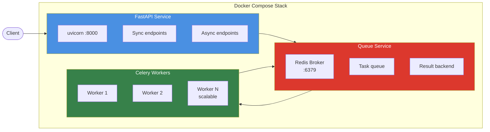

# Creative Automation Pipeline

AI-powered marketing creative generation system that transforms campaign briefs into production-ready assets across multiple platforms. Built with FastAPI, Celery, and GenAI providers (OpenAI, Google), featuring autonomous monitoring and intelligent alerting via Model Context Protocol (MCP).

## Overview

**Tech Stack:** Python 3.11+ | FastAPI | Pydantic | Celery | Redis | SQLite | OpenAI/Google Gemini | Pillow | Docker | MCP

**Key Capabilities:**

- Multi-provider GenAI with runtime switching (OpenAI, Gemini)
- Multi aspect ratio asset generation (1x1, 9x16, 16x9)
- Dual processing modes: synchronous (low-latency) and asynchronous (high-throughput)
- Smart asset reuse with database-backed tracking
- Queue-based distributed processing with Redis + Celery
- AI monitoring agent with autonomous SLA tracking and intelligent alerting
- LLM-powered stakeholder communications via Model Context Protocol

**Use Case:** Enterprise marketing teams need to generate platform-optimized creative assets at scale. This system automates image generation, variant creation, text overlay, and proactive monitoring while maintaining cost efficiency through asset reuse.

## 📋 Table of Contents

- [Quick Start - Commands to run the pipeline](#quick-start)
  - [Prerequisites](#prerequisites)
  - [Configure environment variables](#configure-environment-variables)
  - [Quickest way to run the pipeline](#quickest-way-to-run-the-pipeline)
  - [Step by step guide for each command](#step-by-step-guide)
- [Architecture](#architecture)
- [Examples](#examples)
- [Design Decisions](#design-decisions)
- [Technical Highlights](#technical-highlights)
- [API Reference](#api-reference)
- [Roadmap](#roadmap)
- [Project Structure](#project-structure)
- [Documentation](#documentation)

---

## Quick Start

### Prerequisites

- Docker Desktop (for containerised deployment)
- OpenAI API key (`OPENAI_API_KEY`) AND Google AI API key (`GOOGLE_AI_API_KEY`)

**Output:** Assets will be saved to `outputs/{campaign_id}/{product_id}/{aspect_ratio}/`

### Configure environment variables

```bash
# TODO: Add OPENAI_API_KEY and GOOGLE_AI_API_KEY to .env
cp .env.example .env
```

### Quickest way to run the pipeline

Start up Docker Desktop. To get all services up and running quickly, use the provided convenience scripts.

**Start services and test the API:**

This will build and start all Docker containers and then run a series of API tests to run the pipeline.

1. It will select the OpenAI provider and model and process a single product.
2. It will change the model to Google Gemini to asynchronously process a multi product (3) campaign and provide the job id to poll the status of the job.

```bash
bash ./scripts/start_and_test_api.sh
```

**AI monitoring agent:**

This script seeds a demo campaign with pre-defined issues and then tests the AI monitoring agent's ability to detect and report on them.

1. It will detect the seeded errors immediately (>3 failures threshold)
2. Call LLM with MCP tools to generate contextual alert
3. It will log the alert to console and (if configured) send email/Slack notification.

```bash
bash ./scripts/seed_and_test_agent.sh
```

After running the script, you can monitor the agent's logs in a separate terminal:

```bash
docker compose logs -f agent
```

### Step by step guide

Please refer to [INSTRUCTIONS.md](docs/INSTRUCTIONS.md) for a step by step guide on how to run the pipeline and test the API and AI monitoring agent.

## Architecture

**Please refer to [Creative.AI](assignment/CREATIVE%20AI.pdf) for the System Architecture**

## Examples

### Campaign Brief Input Structure

```json
{
  "campaign_id": "summer-splash-eu-2025",
  "products": [
    {
      "id": "prod_beach_towel_001",
      "name": "Premium Beach Towel",
      "description": "Luxurious oversized beach towel with vibrant patterns"
    },
    {
      "id": "prod_sunscreen_spf50",
      "name": "Ultra Protection Sunscreen SPF 50",
      "description": "Dermatologist-tested sunscreen for all skin types"
    }
  ],
  "target_market": "EU",
  "target_audience": "Active families aged 25-45",
  "campaign_message": "Make Waves This Summer!",
  "brand_colors": ["#FF6B35", "#004E89", "#F4F4F4"],
  "locale": "en"
}
```

**Sample Briefs:**

- `examples/brief_single_product.json` - 1 product
- `examples/brief_multi_product.json` - 3 products

### Output Structure

```text
outputs/
  └── summer-splash-eu-2025/
      ├── prod_beach_towel_001/
      │   ├── 1x1/
      │   │   ├── prod_beach_towel_001_1x1_20251009_191530.png
      │   │   └── metadata.json
      │   ├── 9x16/
      │   │   ├── prod_beach_towel_001_9x16_20251009_191545.png
      │   │   └── metadata.json
      │   └── 16x9/
      │       ├── prod_beach_towel_001_16x9_20251009_191600.png
      │       └── metadata.json
      └── prod_sunscreen_spf50/
        └── ... (similar structure)
```

### Metadata JSON

```json
{
  "campaign_id": "winter-warmth-uk-2025",
  "product_id": "prod_thermal_socks_002",
  "product_name": "Thermal Hiking Socks",
  "aspect_ratio": "1x1",
  "dimensions": "1024x1024",
  "platform": "Instagram Feed",
  "target_market": "UK-West",
  "target_audience": "Outdoor enthusiasts aged 30-55",
  "campaign_message": "Stay Warm, Stay Active",
  "provider": "openai",
  "model": "gpt-image-1",
  "reused": false,
  "file_path": "outputs/winter-warmth-uk-2025/prod_thermal_socks_002/1x1/prod_thermal_socks_002_1x1_20251009_211303.png",
  "file_size_bytes": 1917103,
  "created_at": "2025-10-09T21:13:03.135350",
  "checksum_md5": "63309cb3273bfa5a36087a63f406d858"
}
```

---

## Design Decisions

### 1. Multi-Provider Image Generation Service

Image generation service considered:

- Adobe Firefly
- Google Gemini (gemini-2.5-flash-image)
- OpenAI (DALL-E 3, gpt-image-1, gpt-image-1-mini)

Adobe Firefly was preferred but I do not have an enterprise license for it.

**Decision:** Support both OpenAI and Google Gemini with runtime switching through API endpoint /select-model and CLI questionary.

**Rationale:**

- **Vendor resilience:** Avoid single-provider dependency; fallback during outages or rate limits
- **Cost optimization:** Google Gemini 40% cheaper for certain use cases ($0.04 vs $0.08 per image)
- **Quality tradeoffs:** OpenAI excels at photorealistic imagery; Gemini faster for styled content

**Implementation:**

```python
# src/services/genai.py
class GenAIOrchestrator:
    def __init__(self):
        self.openai_client = OpenAIImageClient()
        self.google_client = GoogleImageClient()
        self.current_provider = "openai"  # Runtime switchable
    
    async def generate_image(self, prompt: str, width: int, height: int):
        if self.current_provider == "openai":
            return await self.openai_client.generate(...)
        else:
            return await self.google_client.generate(...)
```

**Runtime switching via API:**

```bash
curl -X POST http://localhost:8000/select-model \
  -H "Content-Type: application/json" \
  -d '{"provider": "google", "model": "gemini-2.5-flash-image"}'
```

**Enterprise implications:** Critical for Adobe's multi-cloud strategy and vendor negotiation leverage.

---

### 2. Dual Processing Modes (Sync + Async)

**Rationale:**

- **Sync mode:** Low-latency for real-time creative approvals (< 3 products, 30-90s response)
- **Async mode:** High-throughput for batch campaigns (10+ products, scales horizontally)
- **Resource isolation:** Workers can be independently scaled without affecting API responsiveness

**Queue-Based Architecture:**



**Scalability example:**

```bash
# Handle 100 concurrent campaigns
docker compose up -d --scale worker=20

# Each worker processes 1 campaign (3 products × 3 ratios = 9 images)
# Total throughput: 180 images/minute (assuming 30s/image)
```

**Enterprise implications:** Supports Adobe's need for both interactive tools (sync) and overnight batch processing (async).

---

### 3. Model Context Protocol for Agent

**Rationale:**

Traditional approach (pre-assembled context):

```python
# ❌ Inefficient: Include all data regardless of relevance
context = {
    "campaign": db.get_campaign(campaign_id),
    "variants": db.get_all_variants(campaign_id),  # Could be 100+ records
    "errors": db.get_all_errors(campaign_id),      # Could be 1000+ records
    "alerts": db.get_all_alerts(campaign_id)
}
prompt = f"Analyze this campaign: {context}"
# Result: 50,000 tokens, 90% irrelevant
```

MCP approach (intelligent tool calling):

```python
# ✅ Efficient: LLM requests only needed data
tools = [
    get_campaign_details,     # Called first (always needed)
    get_recent_errors,        # Called only if errors detected
    analyze_root_cause        # Called only for error alerts
]
# Result: 2,000 tokens, 100% relevant
```

**Benefits:**

- **Token efficiency:** 75% reduction in API costs (only fetch relevant data)
- **Accuracy:** LLM decides which context to gather based on alert type
- **Extensibility:** Add new tools without modifying prompts or logic

**Enterprise implications:** Critical for Adobe's scale (1000s of campaigns) where naive context assembly would be prohibitively expensive.

---

### 4. Database-Backed Asset Tracking

**Rationale:**

- **Asset reuse:** Check if product image exists before generating (instant, $0 vs 30-60s, $0.04-0.08)
- **Audit trail:** Complete history of generations, errors, and alerts for compliance
- **Monitoring integration:** Agent queries database for real-time campaign health
- **Production migration:** SQLite for MVP, PostgreSQL-ready schema

**Asset Reuse Logic:**

```python
# src/services/storage.py
def get_asset(self, product_id: str, aspect_ratio: str):
    """Check if asset already exists in database."""
    variant = self.db.get_variant_by_product_ratio(product_id, aspect_ratio)
    if variant and os.path.exists(variant['file_path']):
        logger.info(f"Reusing existing asset: {variant['file_path']}")
        return variant['file_path']
    return None
```

**Cost savings example:**

```text
Campaign 1: 10 products × 3 ratios = 30 generations ($2.40)
Campaign 2: Same 10 products = 0 generations ($0.00) ← 100% reuse
Campaign 3: 5 new + 5 existing = 15 generations ($1.20) ← 50% reuse
```

**Database schema:**

```sql
CREATE TABLE campaigns (
    campaign_id TEXT PRIMARY KEY,
    status TEXT CHECK(status IN ('pending', 'processing', 'completed', 'failed')),
    created_at TIMESTAMP DEFAULT CURRENT_TIMESTAMP
);

CREATE TABLE variants (
    id INTEGER PRIMARY KEY AUTOINCREMENT,
    campaign_id TEXT,
    product_id TEXT,
    aspect_ratio TEXT,
    file_path TEXT,
    FOREIGN KEY (campaign_id) REFERENCES campaigns(campaign_id)
);

CREATE TABLE errors (
    campaign_id TEXT,
    error_type TEXT,
    error_message TEXT,
    created_at TIMESTAMP DEFAULT CURRENT_TIMESTAMP
);
```

**Enterprise implications:** Adobe operates at scale where asset reuse can save $10,000s monthly and compliance requires full audit trails.

---

## Technical Highlights

**Async Python:**

- FastAPI with async/await for non-blocking I/O
- Concurrent image generation using `asyncio.gather()`
- HTTP client connection pooling with `httpx.AsyncClient`

**Distributed Task Queue:**

- Celery workers with Redis broker for fault-tolerant job processing
- Result backend for async job status polling
- Worker auto-scaling with Docker Compose

**LLM Tool Calling:**

- Structured outputs using OpenAI function calling API
- MCP server exposes campaign data as callable tools
- Agent interprets tool results and generates contextual alerts

**Containerisation:**

- Multi-service orchestration with Docker Compose
- Separate containers for API, workers, agent, MCP, Redis
- Volume mounts for persistent database and outputs

**Observability:**

- Structured JSON logging with correlation IDs
- Error tracking in database for pattern analysis
- Agent heartbeat endpoint for health monitoring

---

## API Reference

| Endpoint | Method | Auth | Description | Response Time |
|----------|--------|------|-------------|---------------|
| `/health` | GET | No | Service health check | Instant |
| `/select-model` | POST | No | Change GenAI provider/model | Instant |
| `/current-model` | GET | No | Get current model config | Instant |
| `/campaigns/process` | POST | Yes | Synchronous processing | 30-120s (blocking) |
| `/campaigns/jobs` | POST | Yes | Async job submission | Instant (202) |
| `/campaigns/jobs/{id}` | GET | Yes | Job status polling | Instant |
| `/agent/status` | GET | No | Agent heartbeat status | Instant |

**Authentication:** All protected endpoints require `X-API-Key` header matching `API_AUTH_TOKEN` env var.

**Interactive API Documentation:**

- Swagger UI: <http://localhost:8000/docs>
- ReDoc: <http://localhost:8000/redoc>

**Full API Reference:** See [docs/API_REFERENCE.md](docs/API_REFERENCE.md)

---

## Roadmap

Refer to [Creative.AI](assignment/CREATIVE%20AI.pdf)

---

## Project Structure

```text
creative-ai/
├── src/
│   ├── main.py                 # FastAPI application
│   ├── cli.py                  # CLI interface
│   ├── tasks.py                # Celery task definitions
│   ├── services/
│   │   ├── genai.py            # Multi-provider orchestrator
│   │   ├── openai_image_client.py
│   │   ├── google_image_client.py
│   │   ├── processor.py        # Image processing (resize, overlay)
│   │   └── storage.py          # Storage manager with asset reuse
│   ├── agent/
│   │   ├── monitor.py          # Autonomous monitoring loop
│   │   ├── llm_client.py       # LLM integration for alerts
│   │   ├── alerting.py         # Email/Slack delivery
│   │   └── context.py          # Alert context assembly
│   ├── mcp/
│   │   ├── server.py           # MCP server (FastAPI on :8001)
│   │   ├── endpoints.py        # Tool endpoints
│   │   └── models.py           # MCP request/response schemas
│   └── db/
│       ├── database.py         # SQLite client
│       └── schema.sql          # Database schema
├── test/
│   ├── seed_demo.py            # Demo data for agent testing
│   └── test_*.py               # Test suite
├── examples/
│   ├── brief_single_product.json
│   └── brief_multi_product.json
├── docs/
│   ├── ARCHITECTURE.md         # Detailed architecture
│   ├── API_REFERENCE.md        # Complete API docs
│   ├── AGENT_SYSTEM.md         # Agent and MCP details
│   └── DEPLOYMENT.md           # Production deployment
├── docker-compose.yml
├── Dockerfile
└── requirements.txt
```

---

## Documentation

- [ARCHITECTURE.md](docs/ARCHITECTURE.md) - System design, components, data flows
- [API_REFERENCE.md](docs/API_REFERENCE.md) - Complete endpoint documentation
- [AGENT_SYSTEM.md](docs/AGENT_SYSTEM.md) - Agent monitoring and MCP details
- [DEPLOYMENT.md](docs/DEPLOYMENT.md) - Production deployment guide
- [DEVELOPMENT.md](docs/DEVELOPMENT.md) - Development setup and testing
- [INSTRUCTIONS.md](docs/INSTRUCTIONS.md) - Step by step guide on how to run the pipeline and test the API and AI monitoring agent

---

**Last Updated:** October 12, 2025
