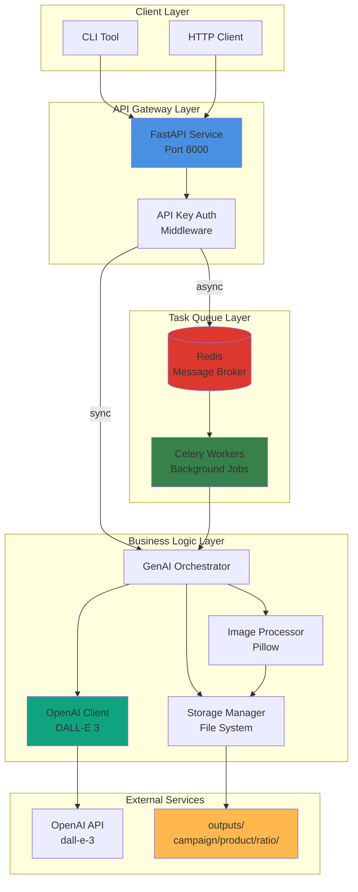
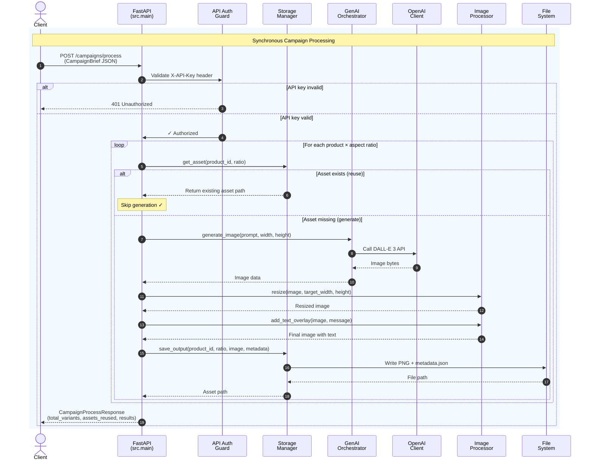
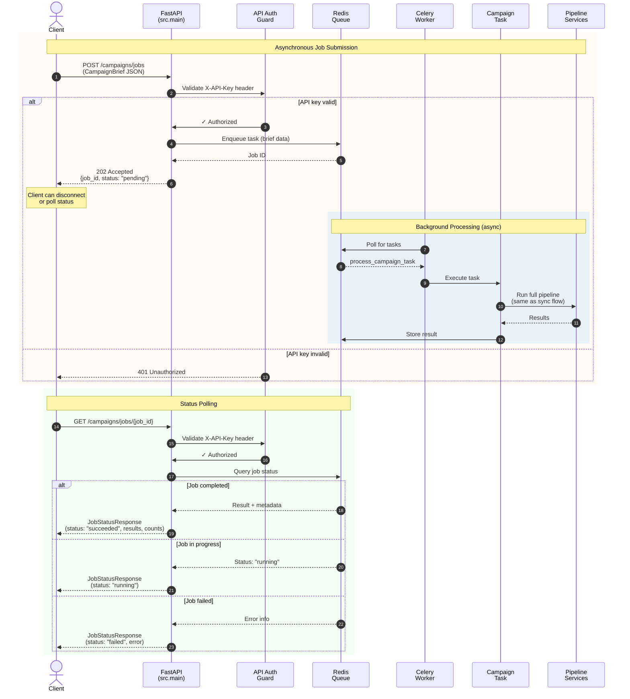
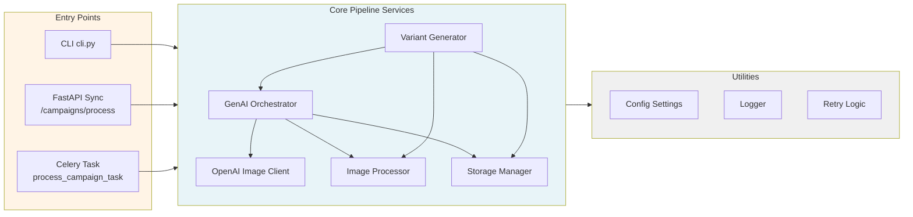
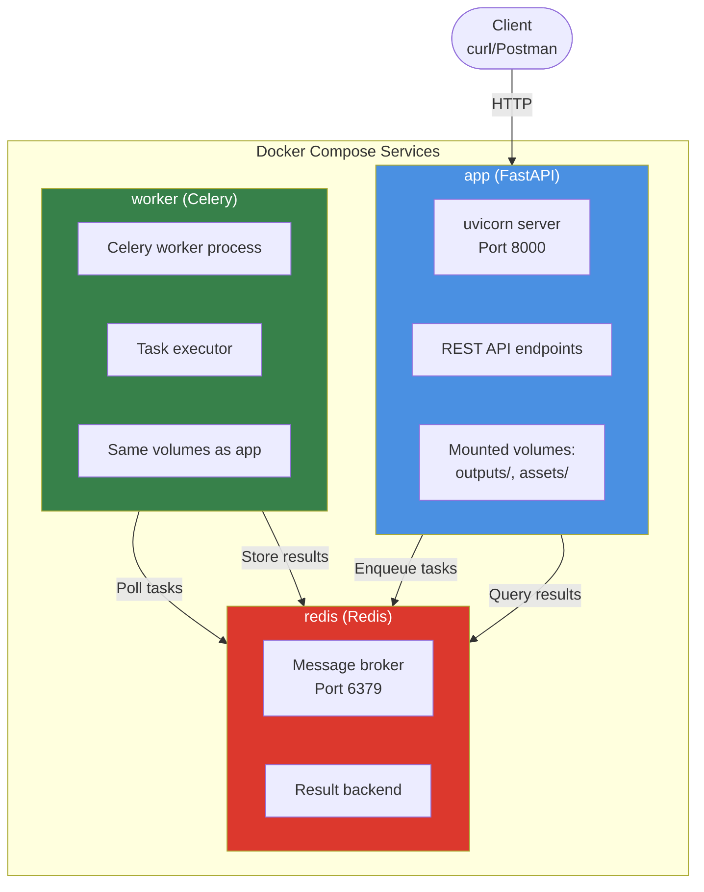
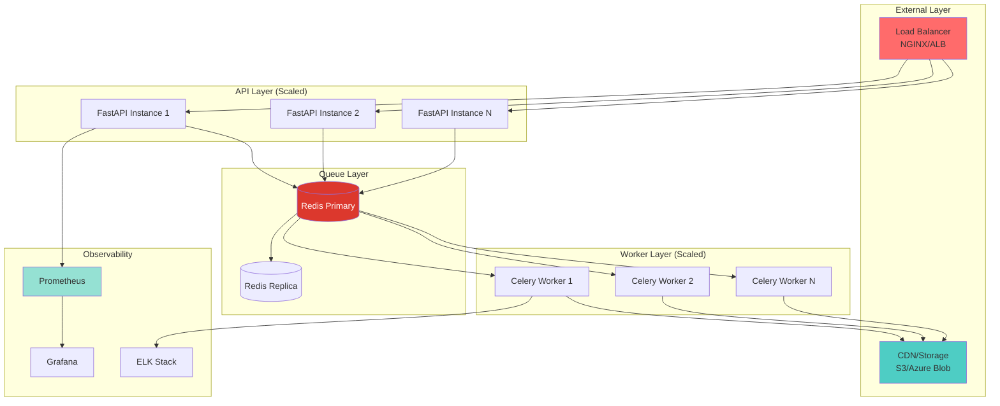

# Creative Automation Pipeline – Quick Start

## Core Functionality

- [x] **Campaign Brief Input** - JSON format with 2+ products
- [x] **Multiple Aspect Ratios** - 1:1, 9:16, 16:9 (Instagram, Stories, YouTube)
- [x] **GenAI Integration** - OpenAI DALL-E 3 primary provider
- [x] **Asset Reuse** - Checks storage before generating
- [x] **Text Overlays** - Campaign message on all images
- [x] **Organized Output** - Structured by campaign/product/ratio
- [x] **Metadata Tracking** - JSON sidecar files with generation details

## Project Structure

```text
src/
├── models/          # Pydantic schemas (brief.py)
├── services/        # GenAI, processor, storage
├── utils/           # Config, logging, retry logic
└── cli.py           # Command-line interface

tests/               # Unit tests (10 tests, all passing)
examples/            # Sample campaign briefs
outputs/             # Generated assets (organized)
```

## Running the Pipeline

### Option 1: CLI (Local with uv)

```bash
# Create and activate virtual environment
uv venv .venv

# Install dependencies
uv pip install -r requirements.txt

# Configure environment
cp .env.example .env
# Add OPENAI_API_KEY to .env (and optional provider settings)

# Run pipeline
uv run -m src.cli --brief {brief.json}
```

### Option 2: FastAPI + Docker (Recommended)

The project now exposes a full HTTP API with both **synchronous** and **asynchronous (queue-based)** processing modes.

```bash
# Create .env file
cp .env.example .env
# Add OPENAI_API_KEY and API_AUTH_TOKEN to .env

# Start the full stack (FastAPI + Redis + Celery worker)
docker compose up -d --build

# Health check
curl http://localhost:8000/health

# Synchronous processing (blocks until complete)
curl -X POST http://localhost:8000/campaigns/process \
  -H "Content-Type: application/json" \
  -H "X-API-Key: dev-token-123" \
  --data @examples/brief_multi_product.json

# Asynchronous processing (returns job ID immediately)
curl -X POST http://localhost:8000/campaigns/jobs \
  -H "Content-Type: application/json" \
  -H "X-API-Key: dev-token-123" \
  --data @examples/brief_multi_product.json

# Poll job status
curl http://localhost:8000/campaigns/jobs/{job_id} \
  -H "X-API-Key: dev-token-123"
```

See [docker-commands.md](docker-commands.md) for PowerShell examples and detailed usage.

---

### Example Input Campaign Brief

```json
{
  "campaign_id": "summer-splash-eu-2025",
  "products": [
    {
      "id": "prod_beach_towel_001",
      "name": "Premium Beach Towel",
      "description": "Luxurious oversized beach towel with vibrant patterns"
    },
    {
      "id": "prod_sunscreen_spf50",
      "name": "Ultra Protection Sunscreen SPF 50",
      "description": "Dermatologist-tested sunscreen for all skin types"
    }
  ],
  "target_market": "EU",
  "target_audience": "Active families aged 25-45",
  "campaign_message": "Make Waves This Summer!",
  "brand_colors": ["#FF6B35", "#004E89", "#F4F4F4"],
  "locale": "en"
}
```

### Expected Output

```text
outputs/
  └── {campaign_id}/
      └── {product_id}/
    │   ├── 1:1/
    │   │   ├── {product_id}_{aspect_ratio}_{timestamp}.png
    │   │   └── metadata.json
    │   ├── 9:16/
    │   │   ├── {product_id}_{aspect_ratio}_{timestamp}.png
    │   │   └── metadata.json
    │   └── 16:9/
    │   │   ├── {product_id}_{aspect_ratio}_{timestamp}.png
    │       └── metadata.json
    └── {product_id}/
        └── ... (similar structure)
```

---

## Architecture

### Execution Modes

The pipeline supports three execution modes:

| Mode | Entry Point | Use Case | Response Time | Scalability |
|------|-------------|----------|---------------|-------------|
| **CLI** | `src.cli` | Local development, testing | Synchronous | Single machine |
| **FastAPI Sync** | `POST /campaigns/process` | Low-latency API calls | Blocks until complete | Horizontal (multi-instance) |
| **FastAPI Async** | `POST /campaigns/jobs` | High-volume batch processing | Immediate (202) | Horizontal + worker scaling |

### API Endpoints

| Endpoint | Method | Auth | Description | Response |
|----------|--------|------|-------------|----------|
| `/health` | GET | No | Service health check | `{"status": "ok"}` |
| `/campaigns/process` | POST | Yes | Synchronous campaign processing | Full results with asset paths |
| `/campaigns/jobs` | POST | Yes | Submit async job to queue | Job ID (202 Accepted) |
| `/campaigns/jobs/{job_id}` | GET | Yes | Poll job status | Status + results when complete |

**Authentication**: All protected endpoints require `X-API-Key` header matching `API_AUTH_TOKEN` from `.env`.

### System Overview

The Creative Automation Pipeline is built on a microservices architecture with FastAPI, Redis queue, and Celery workers.



### Synchronous Processing Flow

When using the `/campaigns/process` endpoint, the request blocks until all assets are generated:



### Asynchronous Processing Flow (Queue-Based)

When using the `/campaigns/jobs` endpoint, the request returns immediately with a job ID. Processing happens in the background:



### Component Interaction



### Docker Compose Stack



---

## Design Decisions

### 1. OpenAI DALL-E 3 as Primary Provider

**Decision**: Use OpenAI's DALL-E 3 (dall-e-3 model) as the primary image generation provider.

**Rationale**:

- **Quality**: Best-in-class image generation quality
- **Accessibility**: Simple API, widely available
- **Reliability**: 99.9% uptime SLA
- **Cost**: $0.04-0.08 per image (reasonable for demo)

**Trade-offs**:

- Cost per image vs. free alternatives
- API rate limits (50 requests/min for standard tier)

**Alternatives Considered**:

- Google Imagen (enterprise alternative, requires GCP setup)
- Hugging Face SDXL (free but slower, lower quality)
- Adobe Firefly (best for brand safety, not enabled due to no subscription)

### 2. Pydantic v2 for Validation

**Decision**: Use Pydantic v2 for all data validation.

**Rationale**:

- **Type Safety**: Catch errors at parse time, not runtime
- **Auto-Documentation**: Field descriptions for API docs
- **Settings Management**: pydantic-settings for .env files
- **Performance**: 2x faster than Pydantic v1

**Example**:

```python
class CampaignBrief(BaseModel):
    products: List[Product] = Field(..., min_length=2)
    campaign_message: str = Field(..., max_length=100)
```

### 3. Asset Reuse Strategy

**Decision**: Check storage before generating new images.

**Rationale**:

- **Cost Savings**: Avoid duplicate GenAI API calls
- **Speed**: Instant asset retrieval vs. 30-60s generation
- **Consistency**: Reuse approved assets

**Implementation**:

```python
existing_asset = storage.get_asset(product_id, ratio_name)
if existing_asset:
    image_data = existing_asset  # Reuse
else:
    image_data = await genai.generate_image(...)  # Generate
```

### 4. Local Storage for MVP

**Decision**: Use local filesystem instead of cloud storage for MVP.

**Rationale**:

- **Simplicity**: No cloud account setup for reviewers
- **Demo-Friendly**: Works offline after initial generation
- **Organized Structure**: Clear folder hierarchy
- **Future-Ready**: StorageManager interface allows easy swap to S3/Azure

**Structure**:

```text
outputs/
  └── {campaign_id}/
      └── {product_id}/
          └── {aspect_ratio}/
              ├── image.png
              └── metadata.json
```

### 5. Retry Logic with Exponential Backoff

**Decision**: Implement @async_retry decorator for API calls.

**Rationale**:

- **Resilience**: Handle transient network failures
- **Rate Limits**: Automatic backoff on 429 errors
- **User Experience**: Transparent recovery without manual intervention

**Configuration**:

```python
@async_retry(max_attempts=3, backoff_factor=2.0)
async def generate_image(...):
    # 2s, 4s, 8s delay between retries
```

### 6. Parallel Aspect Ratio Generation

**Decision**: Generate all aspect ratios concurrently using asyncio.gather().

**Rationale**:

- **Performance**: 3x faster than sequential (60s → 20s)
- **Resource Utilization**: Maximize API throughput
- **Scalability**: Easily handle 10+ products

**Implementation**:

```python
tasks = [generate_variant(...) for ratio in ASPECT_RATIOS]
results = await asyncio.gather(*tasks)
```

### 7. FastAPI + Queue Architecture

**Decision**: Implement both synchronous and asynchronous processing modes with FastAPI + Redis + Celery.

**Rationale**:

- **Flexibility**: Sync mode for real-time needs, async for batch processing
- **Scalability**: Horizontal scaling of API instances and workers independently
- **Reliability**: Queue-based processing with job status tracking
- **Production-Ready**: Standard architecture pattern for microservices

**Architecture Components**:

```python
# Synchronous endpoint (blocking)
@app.post("/campaigns/process")
async def process_campaign(brief: CampaignBrief):
    # Execute pipeline immediately, return when complete
    return CampaignProcessResponse(...)

# Asynchronous endpoint (queue-based)
@app.post("/campaigns/jobs")
async def create_job(brief: CampaignBrief):
    task = process_campaign_task.delay(brief.model_dump())
    return JobCreateResponse(job_id=task.id, status="pending")
```

**Benefits**:

- **Dual Mode**: Choose sync for low-latency or async for high-volume
- **API Authentication**: Simple X-API-Key header-based auth
- **Health Monitoring**: `/health` endpoint for load balancer checks
- **Worker Scaling**: `docker compose up -d --scale worker=N`
- **Result Persistence**: Redis stores job results for status polling

---

## Assumptions & Limitations

### Assumptions

1. **API Access**: OpenAI API key with DALL-E 3 access is available
2. **Internet Connectivity**: Stable connection for API calls
3. **Input Format**: Campaign briefs provided as valid JSON
4. **Storage**: Sufficient disk space (~50MB per campaign)
5. **Fonts**: System has default fonts for text overlay
6. **Scale**: 2-10 products per campaign (optimized for demo)

### Limitations

1. **GenAI Quality**: Output depends on prompt engineering and model constraints
2. **Brand Compliance**: Basic text overlay, not full brand guideline enforcement
3. **Scalability**: Single-process execution, not optimized for 100+ concurrent campaigns
4. **Error Recovery**: Simple retry logic, no sophisticated failure handling
5. **Localization**: English primary, multi-language text rendering not fully tested

### Out of Scope (Future Enhancements)

- Advanced compliance checks (ML-based logo detection)
- Cloud deployment (Azure/AWS infrastructure)
- Production authentication/authorisation
- Web UI (Streamlit/React frontend)
- Multi-language localisation beyond English
- Video asset generation
- A/B testing recommendations

---

## Cost Analysis

### OpenAI API Pricing (DALL-E 3)

| Size | Quality | Cost per Image |
|------|---------|----------------|
| 1024x1024 | Standard | $0.040 |
| 1024x1792 | Standard | $0.080 |
| 1792x1024 | Standard | $0.080 |

### Demo Cost Estimate

**Scenario**: 9 images (3 products × 3 aspect ratios)

- **Standard Quality**: 9 × $0.06 (avg) = **$0.54 per campaign**
- **HD Quality**: 9 × $0.12 (avg) = **$1.08 per campaign**

**Monthly Scale**: 100 campaigns/month = **$54-108/month**

### Cost Optimization Strategies

1. **Asset Reuse**: Check storage before generation (-50% cost)
2. **Batch Processing**: Group similar products for prompt efficiency
3. **Cache Prompts**: Store successful prompt → image mappings
4. **Fallback Providers**: Use free Hugging Face SDXL for non-critical assets

---

## Deployment Considerations

### Current Implementation (FastAPI + Docker)

The project now includes a production-ready FastAPI service with:

- **API Server**: Uvicorn ASGI server with FastAPI framework
- **Task Queue**: Redis message broker with Celery workers
- **Authentication**: API key-based auth via `X-API-Key` header
- **Containerization**: Docker Compose for orchestration
- **Dual Processing Modes**:
  - **Synchronous** (`/campaigns/process`): Blocking request/response
  - **Asynchronous** (`/campaigns/jobs`): Queue-based background processing

**Stack Components**:

| Component | Technology | Purpose |
|-----------|-----------|---------|
| **API Gateway** | FastAPI 0.104+ | REST endpoints, request validation |
| **Message Broker** | Redis 7.x | Task queue, result backend |
| **Worker Pool** | Celery 5.x | Background job execution |
| **Web Server** | Uvicorn | ASGI server for FastAPI |
| **Orchestration** | Docker Compose | Multi-container management |

### Scaling for Production



### Production Enhancements Roadmap

1. **Queue System** ✅ (Implemented)
   - Redis + Celery for async job processing
   - Job status tracking and result retrieval

2. **Cloud Storage** (Next)
   - S3/Azure Blob for multi-region asset access
   - Replace local filesystem storage

3. **Monitoring** (Recommended)
   - Prometheus + Grafana for metrics
   - OpenTelemetry for distributed tracing
   - Health check endpoints (✅ implemented: `/health`)

4. **Logging** (Recommended)
   - ELK stack or CloudWatch for centralized logs
   - Structured JSON logging (✅ already implemented)

5. **Authentication** (Recommended)
   - OAuth2/JWT for production API access
   - Basic API key auth (✅ implemented: `X-API-Key`)

6. **Rate Limiting** (Recommended)
   - Token bucket or sliding window
   - Per-client quota management

7. **Database** (Optional)
   - PostgreSQL for campaign/variant tracking
   - Currently using file-based metadata

---

## 📚 References

- [OpenAI DALL-E 3 API Docs](https://platform.openai.com/docs/guides/images)
- [Pydantic Documentation](https://docs.pydantic.dev/)
- [FastAPI Documentation](https://fastapi.tiangolo.com/)
- [Pillow (PIL) Documentation](https://pillow.readthedocs.io/)

---
