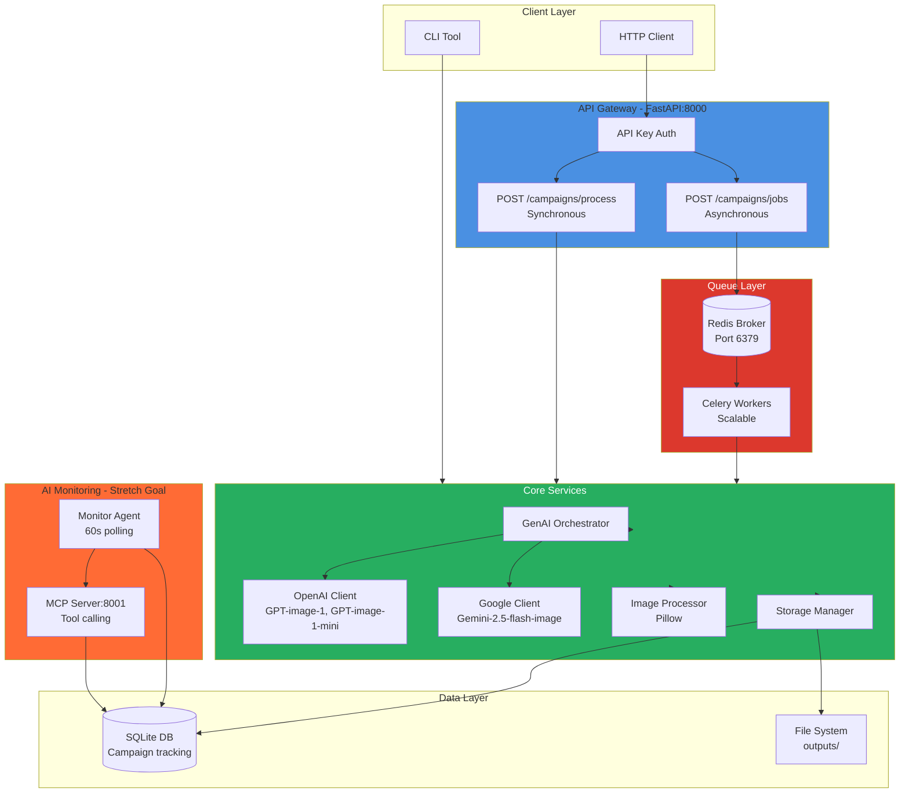
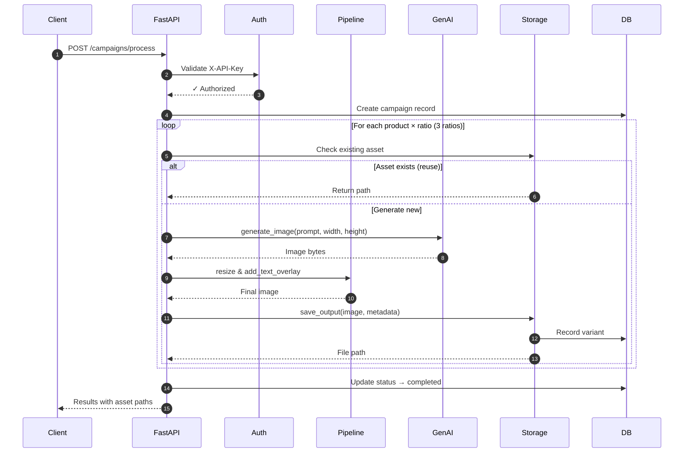
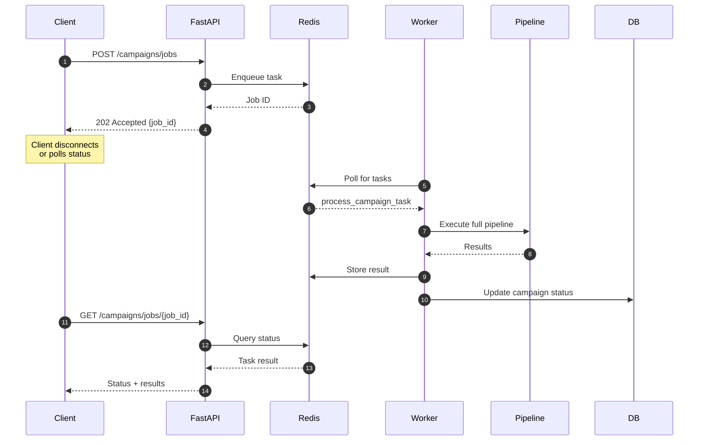
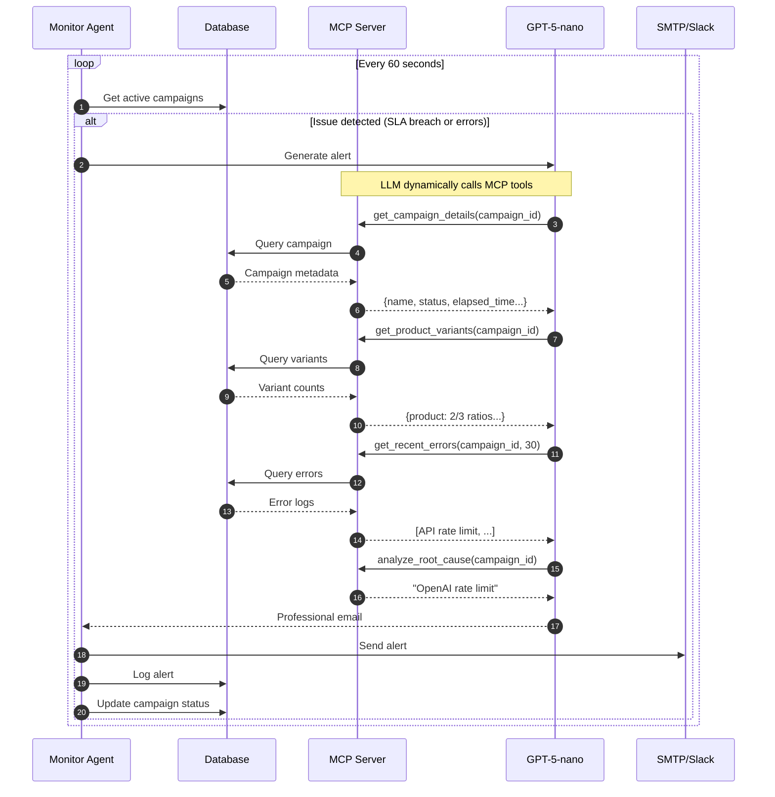

# Creative Automation Pipeline

AI-powered marketing creative generation system that transforms campaign briefs into production-ready assets across multiple platforms. Built with FastAPI, Celery, and GenAI providers (OpenAI, Google), featuring autonomous monitoring and intelligent alerting via Model Context Protocol (MCP).

## Overview

**Tech Stack:** Python 3.11+ | FastAPI | Celery | Redis | SQLite | OpenAI/Google Gemini | Pillow | Docker

**Key Capabilities:**

- Multi-provider GenAI with runtime switching (OpenAI DALL-E, Google Gemini)
- Multi aspect ratio asset generation (1x1, 9x16, 16x9)
- Dual processing modes: synchronous (low-latency) and asynchronous (high-throughput)
- Smart asset reuse with database-backed tracking
- Queue-based distributed processing with Redis + Celery
- AI monitoring agent with autonomous SLA tracking and intelligent alerting
- LLM-powered stakeholder communications via Model Context Protocol

**Use Case:** Enterprise marketing teams need to generate platform-optimized creative assets at scale. This system automates image generation, variant creation, text overlay, and proactive monitoring while maintaining cost efficiency through asset reuse.

## 📋 Table of Contents

- [Quick Start - Commands to run the pipeline](#quick-start)
- [Testing the Monitoring Agent](#testing-the-monitoring-agent)
- [Architecture](#architecture)
- [Design Decisions](#design-decisions)
- [Technical Highlights](#technical-highlights)
- [API Reference](#api-reference)
- [Roadmap](#roadmap)
  - [Current Capabilities](#current-capabilities-v10)
  - [Stretch Goals Completed](#stretch-goals-completed-)
  - [Future Enhancements](#future-enhancements-v20)
- [Project Structure](#project-structure)
- [Documentation](#documentation)

---

## Quick Start

### Prerequisites

- Python 3.11+ and [uv](https://github.com/astral-sh/uv) package manager
- Docker + Docker Compose (for containerized deployment)
- curl (bash) or PowerShell (Windows)
- OpenAI API key (`OPENAI_API_KEY`) or Google AI API key (`GOOGLE_AI_API_KEY`)

**Output:** Assets saved to `outputs/{campaign_id}/{product_id}/{aspect_ratio}/`

### Docker Usage

For production-like environments with all services:

```bash
# 1. Configure environment
cp .env.example .env
# Add OPENAI_API_KEY and API_AUTH_TOKEN to .env

# 2. Start all services (API + Redis + Workers + Agent + MCP)
docker-compose up -d --build
```

**Bash:**

```bash
# Health check
curl http://localhost:8000/health
# {"status": "ok"}

# Synchronous processing (blocks until complete)
curl -X POST http://localhost:8000/campaigns/process \
  -H "Content-Type: application/json" \
  -H "X-API-Key: dev-token-123" \
  --data @examples/brief_single_product.json

# Asynchronous processing (returns job ID immediately)
curl -X POST http://localhost:8000/campaigns/jobs \
  -H "Content-Type: application/json" \
  -H "X-API-Key: dev-token-123" \
  --data @examples/brief_multi_product.json

# Poll job status
curl http://localhost:8000/campaigns/jobs/{job_id} \
  -H "X-API-Key: dev-token-123"
```

**PowerShell:**

```powershell
# Synchronous processing (blocks until complete)
$headers = @{ 'X-API-Key' = 'dev-token-123' }   # omit if API_AUTH_TOKEN is not set
$body    = Get-Content -Raw .\examples\brief_multi_product.json
Invoke-RestMethod -Method Post `
  -Uri http://localhost:8000/campaigns/process `
  -Headers $headers `
  -ContentType 'application/json' `
  -Body $body

# Asynchronous processing (returns job ID immediately)
Asynchronous processing (returns job ID immediately)
$headers = @{ 'X-API-Key' = 'dev-token-123' }
$body    = Get-Content -Raw .\examples\brief_multi_product.json
$job = Invoke-RestMethod -Method Post `
  -Uri http://localhost:8000/campaigns/jobs `
  -Headers $headers `
  -ContentType 'application/json' `
  -Body $body
$job

# Poll status
Invoke-RestMethod -Uri ("http://localhost:8000/campaigns/jobs/{0}" -f $job.job_id) -Headers $headers
```

```bash
# Optional: Scale workers for high volume
docker-compose up -d --scale worker=5

# Optional: View logs
docker-compose logs -f worker
docker-compose logs -f agent
```

## Testing the Monitoring Agent

The AI monitoring agent demonstrates autonomous SLA tracking and intelligent alert generation using LLM tool calling via Model Context Protocol.

### Purpose

Shows how the agent:

1. Detects campaigns exceeding SLA thresholds (< 3 variants per product after 10 minutes)
2. Identifies error patterns (>3 failures in 10 minutes)
3. Uses MCP tools to gather contextual campaign data
4. Generates professional, actionable email alerts via LLM

### Step-by-Step Testing

**1. Seed a demo campaign with intentional issues:**

```bash
docker compose exec mcp-server uv run -m test.seed_demo
```

This creates campaign `demo-monitor-001` with:

- Status: `processing` (active)
- 2 products with 0 variants (triggers SLA breach after 10 minutes)
- 4 recent errors (triggers repeated failures alert)

**2. Start the monitoring agent:**

```bash
docker-compose logs -f agent
```

**3. Test MCP server:**

**Bash:**

```bash
# Test MCP server
curl -X POST http://localhost:8001/mcp/tools/get_campaign_details -H "Content-Type: application/json" -d '{"campaign_id":"demo-monitor-001"}'
```

**PowerShell:**

```powershell
Invoke-RestMethod -Method Post `
  -Uri http://localhost:8001/mcp/tools/get_campaign_details `
  -ContentType 'application/json' `
  -Body '{"campaign_id":"demo-monitor-001"}'
```

**4. Test alerts (Expected email output below):**

```bash
docker compose exec mcp-server uv run -m src.cli alerts --text
```

**5. Observe agent behavior:**

The agent polls every 60 seconds and will:

- Detect the seeded errors immediately (>3 failures threshold)
- After 10 minutes, detect SLA breach (0 variants < 3 expected)
- Call LLM with MCP tools to generate contextual alert
- Send email/Slack notification (if configured) or log to console

**5. MCP Tool Calling Flow:**

When the agent detects an issue, it calls the LLM with system instructions and MCP tool definitions. The LLM autonomously decides which tools to call:

```python
# Tools available to LLM:
tools = [
    "get_campaign_details",      # Campaign name, status, timeline
    "get_product_variants",      # Variant counts per product
    "get_recent_errors",         # Filtered error logs
    "get_alert_history",         # Previous alerts (prevent spam)
    "analyze_root_cause"         # Pattern analysis
]
```

The LLM makes function calls like:

```json
{
  "tool_calls": [
    {"function": "get_campaign_details", "arguments": {"campaign_id": "demo-monitor-001"}},
    {"function": "get_recent_errors", "arguments": {"campaign_id": "demo-monitor-001", "limit": 30}},
    {"function": "analyze_root_cause", "arguments": {"campaign_id": "demo-monitor-001"}}
  ]
}
```

**7. Expected Alert Output:**

```text
Subject: ⚠️ Campaign Errors Detected – Demo Monitoring Campaign

Hi Creative Team,

Our automated creative pipeline has detected recurring errors for the Demo Monitoring Campaign.

Issue Summary:
• Campaign: Demo Monitoring Campaign (demo-monitor-001)
• Status: Processing (active for 2 minutes)
• Error Pattern: 4 API rate limit errors in the last 10 minutes
• Root Cause: OpenAI API rate limit exceeded

Affected Products:
• prod_a: 0/3 variants completed
• prod_b: 0/3 variants completed

Recommended Actions:
1. Switch to Google Gemini provider for immediate retry
2. Review API quota limits in OpenAI dashboard
3. Consider implementing exponential backoff

The system will automatically retry with backoff. No immediate action required.

Best regards,
Creative Automation Agent
```

**8. Check agent status:**

```bash
curl http://localhost:8000/agent/status
```

Returns:

```json
{
  "status": "running",
  "last_heartbeat": "2025-10-09T19:45:30",
  "last_active_campaigns": 1,
  "check_interval": 60,
  "sla_threshold_minutes": 10
}
```

---

## Architecture

### System Overview

The pipeline uses a microservices architecture with clear separation of concerns:



### Synchronous Processing Flow

Request blocks until all assets are generated. Suitable for real-time use cases with <3 products.



### Asynchronous Processing Flow

Request returns immediately with job ID. Suitable for high-volume batch processing (10+ products).



### AI Monitoring Agent with Model Context Protocol

The agent autonomously monitors campaigns and generates intelligent alerts using LLM tool calling:



---

## Examples

### Campaign Brief Structure

```json
{
  "campaign_id": "summer-splash-eu-2025",
  "products": [
    {
      "id": "prod_beach_towel_001",
      "name": "Premium Beach Towel",
      "description": "Luxurious oversized beach towel with vibrant patterns"
    },
    {
      "id": "prod_sunscreen_spf50",
      "name": "Ultra Protection Sunscreen SPF 50",
      "description": "Dermatologist-tested sunscreen for all skin types"
    }
  ],
  "target_market": "EU",
  "target_audience": "Active families aged 25-45",
  "campaign_message": "Make Waves This Summer!",
  "brand_colors": ["#FF6B35", "#004E89", "#F4F4F4"],
  "locale": "en"
}
```

**Sample Briefs:**

- `examples/brief_single_product.json` - 1 product
- `examples/brief_multi_product.json` - 3 products

### Output Structure

```text
outputs/
  └── summer-splash-eu-2025/
      ├── prod_beach_towel_001/
      │   ├── 1x1/
      │   │   ├── prod_beach_towel_001_1x1_20251009_191530.png
    │   │   └── metadata.json
      │   ├── 9x16/
      │   │   ├── prod_beach_towel_001_9x16_20251009_191545.png
    │   │   └── metadata.json
      │   └── 16x9/
      │       ├── prod_beach_towel_001_16x9_20251009_191600.png
    │       └── metadata.json
      └── prod_sunscreen_spf50/
        └── ... (similar structure)
```

### Metadata JSON

```json
{
  "campaign_id": "winter-warmth-uk-2025",
  "product_id": "prod_thermal_socks_002",
  "product_name": "Thermal Hiking Socks",
  "aspect_ratio": "1x1",
  "dimensions": "1024x1024",
  "platform": "Instagram Feed",
  "target_market": "UK-West",
  "target_audience": "Outdoor enthusiasts aged 30-55",
  "campaign_message": "Stay Warm, Stay Active",
  "reused": false,
  "file_path": "outputs/winter-warmth-uk-2025/prod_thermal_socks_002/1x1/prod_thermal_socks_002_1x1_20251009_211303.png",
  "file_size_bytes": 1917103,
  "created_at": "2025-10-09T21:13:03.135350",
  "checksum_md5": "63309cb3273bfa5a36087a63f406d858"
}
```

---

## Design Decisions

### 1. Multi-Provider Image Generation Service

Image generation service considered:

- Adobe Firefly
- Google Gemini (gemini-2.5-flash-image)
- OpenAI (DALL-E 3, gpt-image-1, gpt-image-1-mini)

Adobe Firefly was preferred but I do not have an enterprise license for it.

**Decision:** Support both OpenAI and Google Gemini with runtime switching through API endpoint /select-model and CLI questionary.

**Rationale:**

- **Vendor resilience:** Avoid single-provider dependency; fallback during outages or rate limits
- **Cost optimization:** Google Gemini 40% cheaper for certain use cases ($0.04 vs $0.08 per image)
- **Quality tradeoffs:** OpenAI excels at photorealistic imagery; Gemini faster for styled content

**Implementation:**

```python
# src/services/genai.py
class GenAIOrchestrator:
    def __init__(self):
        self.openai_client = OpenAIImageClient()
        self.google_client = GoogleImageClient()
        self.current_provider = "openai"  # Runtime switchable
    
    async def generate_image(self, prompt: str, width: int, height: int):
        if self.current_provider == "openai":
            return await self.openai_client.generate(...)
        else:
            return await self.google_client.generate(...)
```

**Runtime switching via API:**

```bash
curl -X POST http://localhost:8000/select-model \
  -H "Content-Type: application/json" \
  -d '{"provider": "google", "model": "gemini-2.5-flash-image"}'
```

**Enterprise implications:** Critical for Adobe's multi-cloud strategy and vendor negotiation leverage.

---

### 2. Dual Processing Modes (Sync + Async)

**Rationale:**

- **Sync mode:** Low-latency for real-time creative approvals (< 3 products, 30-90s response)
- **Async mode:** High-throughput for batch campaigns (10+ products, scales horizontally)
- **Resource isolation:** Workers can be independently scaled without affecting API responsiveness

**Queue-Based Architecture:**


**Scalability example:**

```bash
# Handle 100 concurrent campaigns
docker-compose up -d --scale worker=20

# Each worker processes 1 campaign (3 products × 3 ratios = 9 images)
# Total throughput: 180 images/minute (assuming 30s/image)
```

**Enterprise implications:** Supports Adobe's need for both interactive tools (sync) and overnight batch processing (async).

---

### 3. Model Context Protocol for Agent

**Rationale:**

Traditional approach (pre-assembled context):

```python
# ❌ Inefficient: Include all data regardless of relevance
context = {
    "campaign": db.get_campaign(campaign_id),
    "variants": db.get_all_variants(campaign_id),  # Could be 100+ records
    "errors": db.get_all_errors(campaign_id),      # Could be 1000+ records
    "alerts": db.get_all_alerts(campaign_id)
}
prompt = f"Analyze this campaign: {context}"
# Result: 50,000 tokens, 90% irrelevant
```

MCP approach (intelligent tool calling):

```python
# ✅ Efficient: LLM requests only needed data
tools = [
    get_campaign_details,     # Called first (always needed)
    get_recent_errors,        # Called only if errors detected
    analyze_root_cause        # Called only for error alerts
]
# Result: 2,000 tokens, 100% relevant
```

**Benefits:**

- **Token efficiency:** 75% reduction in API costs (only fetch relevant data)
- **Accuracy:** LLM decides which context to gather based on alert type
- **Extensibility:** Add new tools without modifying prompts or logic

**Enterprise implications:** Critical for Adobe's scale (1000s of campaigns) where naive context assembly would be prohibitively expensive.

---

### 4. Database-Backed Asset Tracking

**Rationale:**

- **Asset reuse:** Check if product image exists before generating (instant, $0 vs 30-60s, $0.04-0.08)
- **Audit trail:** Complete history of generations, errors, and alerts for compliance
- **Monitoring integration:** Agent queries database for real-time campaign health
- **Production migration:** SQLite for MVP, PostgreSQL-ready schema

**Asset Reuse Logic:**

```python
# src/services/storage.py
def get_asset(self, product_id: str, aspect_ratio: str):
    """Check if asset already exists in database."""
    variant = self.db.get_variant_by_product_ratio(product_id, aspect_ratio)
    if variant and os.path.exists(variant['file_path']):
        logger.info(f"Reusing existing asset: {variant['file_path']}")
        return variant['file_path']
    return None
```

**Cost savings example:**

```text
Campaign 1: 10 products × 3 ratios = 30 generations ($2.40)
Campaign 2: Same 10 products = 0 generations ($0.00) ← 100% reuse
Campaign 3: 5 new + 5 existing = 15 generations ($1.20) ← 50% reuse
```

**Database schema:**

```sql
CREATE TABLE campaigns (
    campaign_id TEXT PRIMARY KEY,
    status TEXT CHECK(status IN ('pending', 'processing', 'completed', 'failed')),
    created_at TIMESTAMP DEFAULT CURRENT_TIMESTAMP
);

CREATE TABLE variants (
    id INTEGER PRIMARY KEY AUTOINCREMENT,
    campaign_id TEXT,
    product_id TEXT,
    aspect_ratio TEXT,
    file_path TEXT,
    FOREIGN KEY (campaign_id) REFERENCES campaigns(campaign_id)
);

CREATE TABLE errors (
    campaign_id TEXT,
    error_type TEXT,
    error_message TEXT,
    created_at TIMESTAMP DEFAULT CURRENT_TIMESTAMP
);
```

**Enterprise implications:** Adobe operates at scale where asset reuse can save $10,000s monthly and compliance requires full audit trails.

---

## Technical Highlights

**Async Python:**

- FastAPI with async/await for non-blocking I/O
- Concurrent image generation using `asyncio.gather()`
- HTTP client connection pooling with `httpx.AsyncClient`

**Distributed Task Queue:**

- Celery workers with Redis broker for fault-tolerant job processing
- Result backend for async job status polling
- Worker auto-scaling with Docker Compose

**LLM Tool Calling:**

- Structured outputs using OpenAI function calling API
- MCP server exposes campaign data as callable tools
- Agent interprets tool results and generates contextual alerts

**Containerization:**

- Multi-service orchestration with Docker Compose
- Separate containers for API, workers, agent, MCP, Redis
- Volume mounts for persistent database and outputs

**Observability:**

- Structured JSON logging with correlation IDs
- Error tracking in database for pattern analysis
- Agent heartbeat endpoint for health monitoring

---

## API Reference

| Endpoint | Method | Auth | Description | Response Time |
|----------|--------|------|-------------|---------------|
| `/health` | GET | No | Service health check | Instant |
| `/select-model` | POST | No | Change GenAI provider/model | Instant |
| `/current-model` | GET | No | Get current model config | Instant |
| `/campaigns/process` | POST | Yes | Synchronous processing | 30-120s (blocking) |
| `/campaigns/jobs` | POST | Yes | Async job submission | Instant (202) |
| `/campaigns/jobs/{id}` | GET | Yes | Job status polling | Instant |
| `/agent/status` | GET | No | Agent heartbeat status | Instant |

**Authentication:** All protected endpoints require `X-API-Key` header matching `API_AUTH_TOKEN` env var.

**Interactive API Documentation:**

- Swagger UI: <http://localhost:8000/docs>
- ReDoc: <http://localhost:8000/redoc>

**Full API Reference:** See [docs/API_REFERENCE.md](docs/API_REFERENCE.md)

---

## Roadmap

### Current Capabilities (v1.0)

- ✅ Multi-provider GenAI (OpenAI, Google)
- ✅ 3 aspect ratio generation (1x1, 9x16, 16x9)
- ✅ Text overlay with customizable styling
- ✅ Asset reuse mechanism
- ✅ REST API (sync + async endpoints)
- ✅ Database campaign tracking
- ✅ Docker Compose deployment
- ✅ Comprehensive test suite
- ✅ AI Monitoring Agent
- ✅ LLM-generated stakeholder communications

### Stretch Goals Completed ✨

- ✅ Interactive CLI tool
- ✅ Queue-based background processing
- ✅ Multi-Channel Delivery - SMTP email and Slack webhooks
- ✅ MCP Server - Dynamic tool calling for alert generation + Separate service for campaign data access

### Future Enhancements (v2.0)

- [ ] Cloud storage (S3, Azure Blob)
- [ ] Advanced brand compliance checks (ML-based logo detection) (only done brand colour match)
- [ ] Video asset generation
- [ ] A/B testing recommendations
- [ ] Web UI (React frontend)
- [ ] Multi-language localization
- [ ] Kubernetes deployment manifests
- [ ] Prometheus metrics + Grafana dashboards

---

## Project Structure

```text
creative-ai/
├── src/
│   ├── main.py                 # FastAPI application
│   ├── cli.py                  # CLI interface
│   ├── tasks.py                # Celery task definitions
│   ├── services/
│   │   ├── genai.py            # Multi-provider orchestrator
│   │   ├── openai_image_client.py
│   │   ├── google_image_client.py
│   │   ├── processor.py        # Image processing (resize, overlay)
│   │   └── storage.py          # Storage manager with asset reuse
│   ├── agent/
│   │   ├── monitor.py          # Autonomous monitoring loop
│   │   ├── llm_client.py       # LLM integration for alerts
│   │   ├── alerting.py         # Email/Slack delivery
│   │   └── context.py          # Alert context assembly
│   ├── mcp/
│   │   ├── server.py           # MCP server (FastAPI on :8001)
│   │   ├── endpoints.py        # Tool endpoints
│   │   └── models.py           # MCP request/response schemas
│   └── db/
│       ├── database.py         # SQLite client
│       └── schema.sql          # Database schema
├── test/
│   ├── seed_demo.py            # Demo data for agent testing
│   └── test_*.py               # Test suite
├── examples/
│   ├── brief_single_product.json
│   └── brief_multi_product.json
├── docs/
│   ├── ARCHITECTURE.md         # Detailed architecture
│   ├── API_REFERENCE.md        # Complete API docs
│   ├── AGENT_SYSTEM.md         # Agent and MCP details
│   └── DEPLOYMENT.md           # Production deployment
├── docker-compose.yml
├── Dockerfile
└── requirements.txt
```

---

## Documentation

- [ARCHITECTURE.md](docs/ARCHITECTURE.md) - System design, components, data flows
- [API_REFERENCE.md](docs/API_REFERENCE.md) - Complete endpoint documentation
- [AGENT_SYSTEM.md](docs/AGENT_SYSTEM.md) - Agent monitoring and MCP details
- [DEPLOYMENT.md](docs/DEPLOYMENT.md) - Production deployment guide
- [DEVELOPMENT.md](docs/DEVELOPMENT.md) - Development setup and testing
- [TECHNICAL_SPEC.md](TECHNICAL_SPEC.md) - Full technical specification

---

**Last Updated:** October 9, 2025
