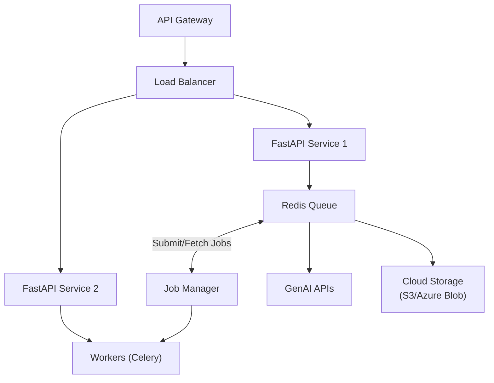

# Creative Automation Pipeline – Quick Start

## Core Functionality

- [x] **Campaign Brief Input** - JSON format with 2+ products
- [x] **Multiple Aspect Ratios** - 1:1, 9:16, 16:9 (Instagram, Stories, YouTube)
- [x] **GenAI Integration** - OpenAI DALL-E 3 primary provider
- [x] **Asset Reuse** - Checks storage before generating
- [x] **Text Overlays** - Campaign message on all images
- [x] **Organized Output** - Structured by campaign/product/ratio
- [x] **Metadata Tracking** - JSON sidecar files with generation details

## Project Structure

```text
src/
├── models/          # Pydantic schemas (brief.py)
├── services/        # GenAI, processor, storage
├── utils/           # Config, logging, retry logic
└── cli.py           # Command-line interface

tests/               # Unit tests (10 tests, all passing)
examples/            # Sample campaign briefs
outputs/             # Generated assets (organized)
```

## Running pipeline

### Option 1: local using uv

```bash
# Create and activate virtual environment
uv venv .venv

# Install dependencies
uv pip install -r requirements.txt

# Configure environment
cp .env.example .env
# Add OPENAI_API_KEY to .env (and optional provider settings)

# Run pipeline
uv run -m src.cli --brief {brief.json}
```

### Option 2: Docker

```bash
# Create .env file
cp .env.example .env
# Add OPENAI_API_KEY to .env (and optional provider settings)

# Build and run (single product brief)
docker compose up --build

# Run with specific brief
docker compose run --rm app uv run -m src.cli --brief examples/brief_multi_product.json
```

---

### Example Input Campaign Brief

```json
{
  "campaign_id": "summer-splash-eu-2025",
  "products": [
    {
      "id": "prod_beach_towel_001",
      "name": "Premium Beach Towel",
      "description": "Luxurious oversized beach towel with vibrant patterns"
    },
    {
      "id": "prod_sunscreen_spf50",
      "name": "Ultra Protection Sunscreen SPF 50",
      "description": "Dermatologist-tested sunscreen for all skin types"
    }
  ],
  "target_market": "EU",
  "target_audience": "Active families aged 25-45",
  "campaign_message": "Make Waves This Summer!",
  "brand_colors": ["#FF6B35", "#004E89", "#F4F4F4"],
  "locale": "en"
}
```

### Expected Output

```text
outputs/
  └── {campaign_id}/
      └── {product_id}/
    │   ├── 1:1/
    │   │   ├── {product_id}_{aspect_ratio}_{timestamp}.png
    │   │   └── metadata.json
    │   ├── 9:16/
    │   │   ├── {product_id}_{aspect_ratio}_{timestamp}.png
    │   │   └── metadata.json
    │   └── 16:9/
    │   │   ├── {product_id}_{aspect_ratio}_{timestamp}.png
    │       └── metadata.json
    └── {product_id}/
        └── ... (similar structure)
```

---

## Design Decisions

### 1. OpenAI DALL-E 3 as Primary Provider

**Decision**: Use OpenAI's DALL-E 3 (dall-e-3 model) as the primary image generation provider.

**Rationale**:

- **Quality**: Best-in-class image generation quality
- **Accessibility**: Simple API, widely available
- **Reliability**: 99.9% uptime SLA
- **Cost**: $0.04-0.08 per image (reasonable for demo)

**Trade-offs**:

- Cost per image vs. free alternatives
- API rate limits (50 requests/min for standard tier)

**Alternatives Considered**:

- Google Imagen (enterprise alternative, requires GCP setup)
- Hugging Face SDXL (free but slower, lower quality)
- Adobe Firefly (best for brand safety, not enabled due to no subscription)

### 2. Pydantic v2 for Validation

**Decision**: Use Pydantic v2 for all data validation.

**Rationale**:

- **Type Safety**: Catch errors at parse time, not runtime
- **Auto-Documentation**: Field descriptions for API docs
- **Settings Management**: pydantic-settings for .env files
- **Performance**: 2x faster than Pydantic v1

**Example**:

```python
class CampaignBrief(BaseModel):
    products: List[Product] = Field(..., min_length=2)
    campaign_message: str = Field(..., max_length=100)
```

### 3. Asset Reuse Strategy

**Decision**: Check storage before generating new images.

**Rationale**:

- **Cost Savings**: Avoid duplicate GenAI API calls
- **Speed**: Instant asset retrieval vs. 30-60s generation
- **Consistency**: Reuse approved assets

**Implementation**:

```python
existing_asset = storage.get_asset(product_id, ratio_name)
if existing_asset:
    image_data = existing_asset  # Reuse
else:
    image_data = await genai.generate_image(...)  # Generate
```

### 4. Local Storage for MVP

**Decision**: Use local filesystem instead of cloud storage for MVP.

**Rationale**:

- **Simplicity**: No cloud account setup for reviewers
- **Demo-Friendly**: Works offline after initial generation
- **Organized Structure**: Clear folder hierarchy
- **Future-Ready**: StorageManager interface allows easy swap to S3/Azure

**Structure**:

```text
outputs/
  └── {campaign_id}/
      └── {product_id}/
          └── {aspect_ratio}/
              ├── image.png
              └── metadata.json
```

### 5. Retry Logic with Exponential Backoff

**Decision**: Implement @async_retry decorator for API calls.

**Rationale**:

- **Resilience**: Handle transient network failures
- **Rate Limits**: Automatic backoff on 429 errors
- **User Experience**: Transparent recovery without manual intervention

**Configuration**:

```python
@async_retry(max_attempts=3, backoff_factor=2.0)
async def generate_image(...):
    # 2s, 4s, 8s delay between retries
```

### 6. Parallel Aspect Ratio Generation

**Decision**: Generate all aspect ratios concurrently using asyncio.gather().

**Rationale**:

- **Performance**: 3x faster than sequential (60s → 20s)
- **Resource Utilization**: Maximize API throughput
- **Scalability**: Easily handle 10+ products

**Implementation**:

```python
tasks = [generate_variant(...) for ratio in ASPECT_RATIOS]
results = await asyncio.gather(*tasks)
```

---

## Assumptions & Limitations

### Assumptions

1. **API Access**: OpenAI API key with DALL-E 3 access is available
2. **Internet Connectivity**: Stable connection for API calls
3. **Input Format**: Campaign briefs provided as valid JSON
4. **Storage**: Sufficient disk space (~50MB per campaign)
5. **Fonts**: System has default fonts for text overlay
6. **Scale**: 2-10 products per campaign (optimized for demo)

### Limitations

1. **GenAI Quality**: Output depends on prompt engineering and model constraints
2. **Brand Compliance**: Basic text overlay, not full brand guideline enforcement
3. **Scalability**: Single-process execution, not optimized for 100+ concurrent campaigns
4. **Error Recovery**: Simple retry logic, no sophisticated failure handling
5. **Localization**: English primary, multi-language text rendering not fully tested

### Out of Scope (Future Enhancements)

- Advanced compliance checks (ML-based logo detection)
- Cloud deployment (Azure/AWS infrastructure)
- Production authentication/authorisation
- Web UI (Streamlit/React frontend)
- Multi-language localisation beyond English
- Video asset generation
- A/B testing recommendations

---

## 📊 Cost Analysis

### OpenAI API Pricing (DALL-E 3)

| Size | Quality | Cost per Image |
|------|---------|----------------|
| 1024x1024 | Standard | $0.040 |
| 1024x1792 | Standard | $0.080 |
| 1792x1024 | Standard | $0.080 |

### Demo Cost Estimate

**Scenario**: 9 images (3 products × 3 aspect ratios)

- **Standard Quality**: 9 × $0.06 (avg) = **$0.54 per campaign**
- **HD Quality**: 9 × $0.12 (avg) = **$1.08 per campaign**

**Monthly Scale**: 100 campaigns/month = **$54-108/month**

### Cost Optimization Strategies

1. **Asset Reuse**: Check storage before generation (-50% cost)
2. **Batch Processing**: Group similar products for prompt efficiency
3. **Cache Prompts**: Store successful prompt → image mappings
4. **Fallback Providers**: Use free Hugging Face SDXL for non-critical assets

---

## 🚢 Deployment Considerations (Production)

### Recommended Architecture for Scale

```text
[API Gateway] → [Load Balancer]
                      ↓
      ┌───────────────┴───────────────┐
      ↓                               ↓
[FastAPI Service 1]         [FastAPI Service 2]
      ↓                               ↓
[Redis Queue] ← Job Manager → [Workers (Celery)]
      ↓
[GenAI APIs] + [Cloud Storage (S3/Azure Blob)]
```



### Key Changes for Production

1. **Queue System**: Redis + Celery for async job processing
2. **Cloud Storage**: S3/Azure Blob for multi-region access
3. **Monitoring**: Prometheus + Grafana for metrics
4. **Logging**: ELK stack for centralized logs
5. **Authentication**: OAuth2 for API access
6. **Rate Limiting**: Token bucket for API quotas
7. **Database**: PostgreSQL for campaign/variant tracking

---

## 📚 References

- [OpenAI DALL-E 3 API Docs](https://platform.openai.com/docs/guides/images)
- [Pydantic Documentation](https://docs.pydantic.dev/)
- [FastAPI Documentation](https://fastapi.tiangolo.com/)
- [Pillow (PIL) Documentation](https://pillow.readthedocs.io/)

---
