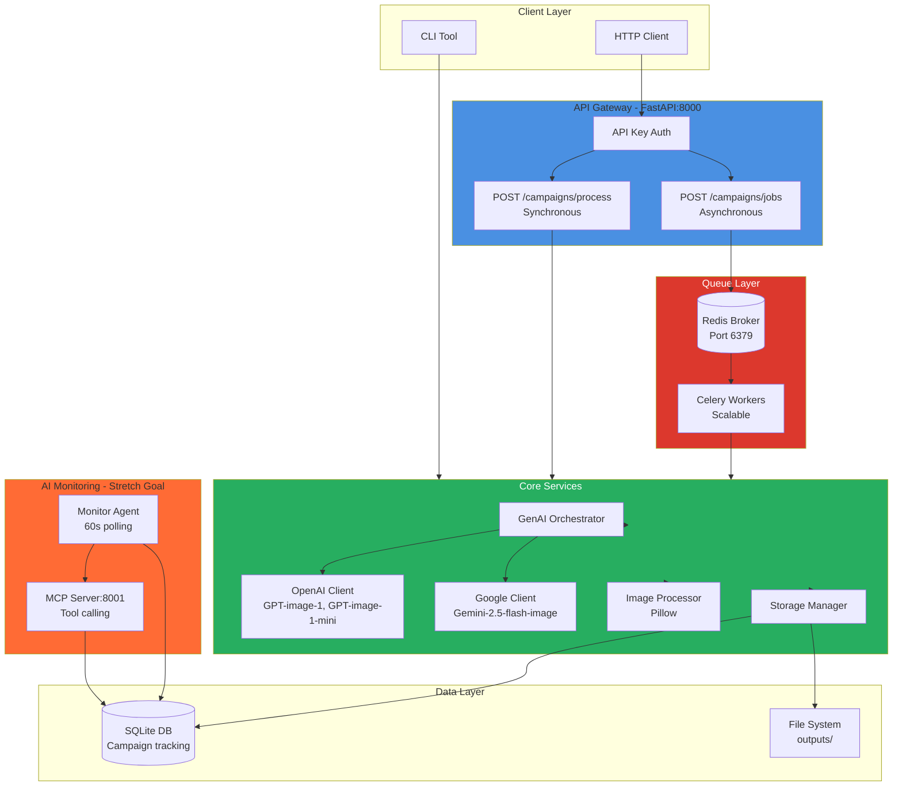
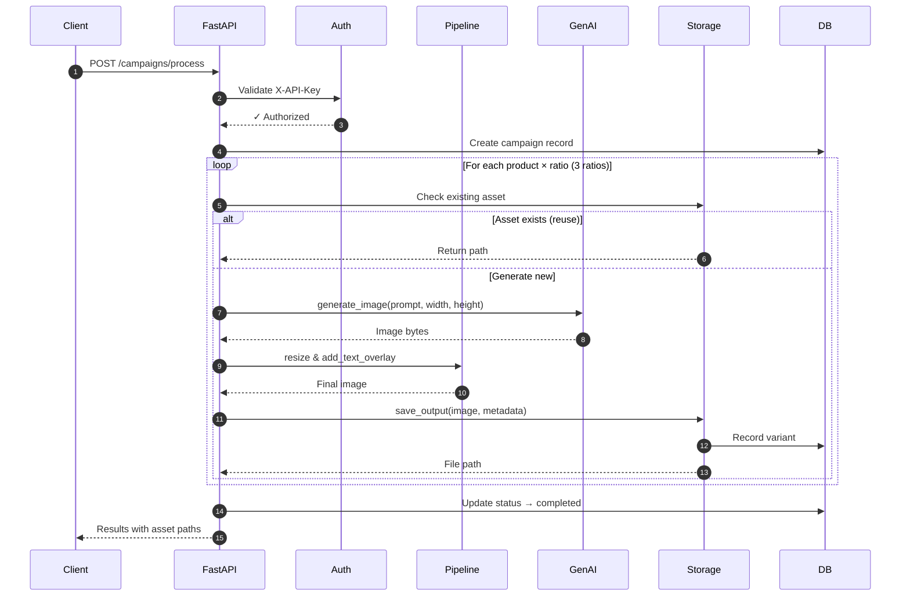
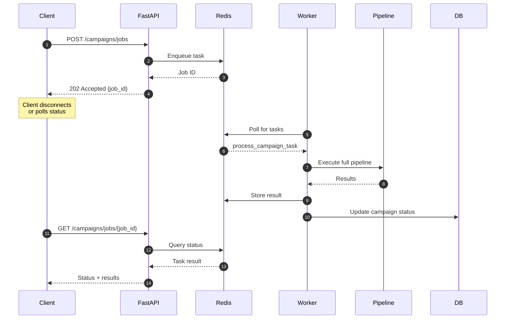
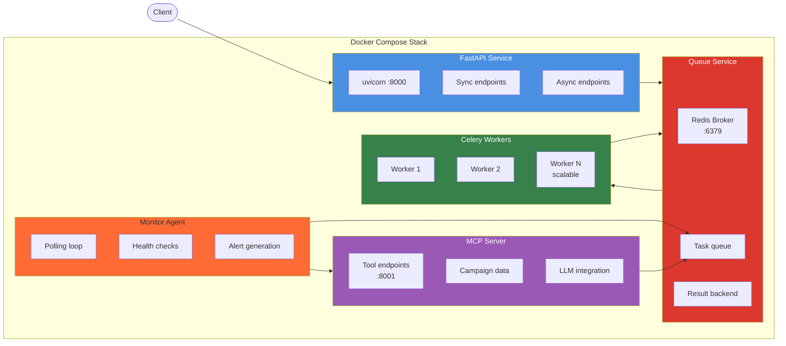
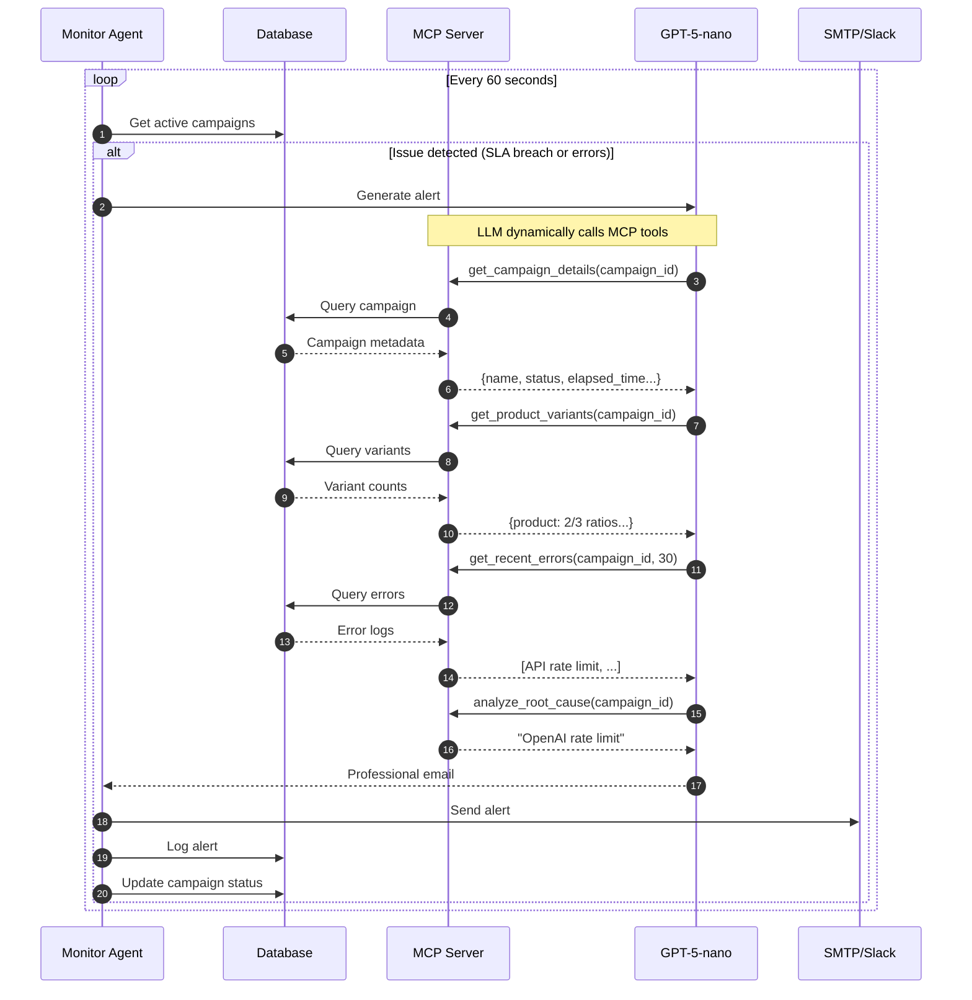

# Creative Automation Pipeline

AI-powered marketing creative generation system that transforms campaign briefs into production-ready assets across multiple platforms. Built with FastAPI, Celery, and GenAI providers (OpenAI, Google), featuring autonomous monitoring and intelligent alerting.

## ✨ Key Features

- ✅ **Multi-Provider GenAI** - OpenAI and Google Gemini support with runtime switching
- ✅ **Multi-Platform Assets** - Generate 1x1 (Instagram), 9x16 (Stories), 16x9 (YouTube) variants
- ✅ **Smart Asset Reuse** - Check storage before generating to save costs
- ✅ **Text Overlays** - Automatic campaign message overlay with customizable styling
- ✅ **Queue-Based Processing** - Redis + Celery for async, scalable job execution
- ✅ **REST API** - FastAPI with sync and async endpoints
- ✅ **AI Monitoring Agent** - Autonomous SLA tracking with Model Context Protocol (MCP) *[Stretch Goal]*
- ✅ **Intelligent Alerts** - LLM-generated stakeholder communications via email/Slack *[Stretch Goal]*
- ✅ **Production Ready** - Docker Compose, database tracking, structured logging

## 📋 Table of Contents

- [Quick Start](#-quick-start)
  - [CLI Usage](#cli-usage)
  - [Docker Usage](#docker-usage-recommended)
- [How It Works](#-how-it-works)
- [Architecture](#-architecture)
- [API Endpoints](#-api-endpoints)
- [Agent Monitoring](#-agent-monitoring-stretch-goal)
- [Configuration](#%EF%B8%8F-configuration)
- [Examples](#-examples)
- [Design Decisions](#-design-decisions)
- [Project Status](#-project-status--roadmap)
- [Documentation](#-documentation)
- [Contributing](#-contributing)

## 🚀 Quick Start

### Prerequisites

- **Python 3.11+** and [uv](https://github.com/astral-sh/uv)
- **Docker + Docker Compose** (for containerized deployment)
- **OpenAI API Key** or **Google AI API Key**

### CLI Usage

For local development and testing:

```bash
# 1. Create and activate virtual environment
uv venv .venv
source .venv/bin/activate  # Linux/macOS
# .\.venv\Scripts\Activate.ps1  # Windows PowerShell

# 2. Install dependencies
uv pip install -r requirements.txt

# 3. Configure environment
cp .env.example .env
# Add OPENAI_API_KEY or GOOGLE_AI_API_KEY to .env

# 4. Process a campaign
uv run -m src.cli process --brief examples/brief_multi_product.json

# 5. With provider selection
uv run -m src.cli process \
  --brief examples/brief_single_product.json \
  --provider google \
  --model gemini-2.5-flash-image

# 6. Interactive mode
uv run -m src.cli interactive
```

**Output:** Assets saved to `outputs/{campaign_id}/{product_id}/{aspect_ratio}/`

### Docker Usage (Recommended)

For production-like environments with all services:

```bash
# 1. Configure environment
cp .env.example .env
# Add OPENAI_API_KEY and API_AUTH_TOKEN to .env

# 2. Start all services (API + Redis + Workers + Agent + MCP)
docker-compose up -d --build

# 3. Health check
curl http://localhost:8000/health
# {"status": "ok"}

# 4. Synchronous processing (blocks until complete)
curl -X POST http://localhost:8000/campaigns/process \
  -H "Content-Type: application/json" \
  -H "X-API-Key: dev-token-123" \
  --data @examples/brief_multi_product.json

# 5. Asynchronous processing (returns job ID immediately)
curl -X POST http://localhost:8000/campaigns/jobs \
  -H "Content-Type: application/json" \
  -H "X-API-Key: dev-token-123" \
  --data @examples/brief_multi_product.json

# 6. Poll job status
curl http://localhost:8000/campaigns/jobs/{job_id} \
  -H "X-API-Key: dev-token-123"

# 7. Scale workers for high volume
docker-compose up -d --scale worker=5

# 8. View logs
docker-compose logs -f worker
docker-compose logs -f agent
```

## 💡 How It Works

### Core Concept

```text
Campaign Brief (JSON) → GenAI Image Generation → 3 Aspect Ratios → Text Overlay → Organized Output
```

1. **Input:** JSON campaign brief with products, target audience, campaign message
2. **Generation:** AI generates product images using OpenAI or Google
3. **Variants:** Create 1x1, 9x16, 16x9 variants for different platforms
4. **Overlay:** Add campaign message as semi-transparent text overlay
5. **Storage:** Save to organized folders with metadata JSON sidecar files
6. **Tracking:** Record variants and errors to SQLite database
7. **Monitoring:** AI agent monitors progress and sends alerts if needed

### Asset Reuse Strategy

Before generating each image, the system checks if an existing asset exists:

```python
existing_asset = storage.get_asset(product_id, ratio)
if existing_asset:
    image_data = existing_asset  # ✅ Reuse (instant, $0 cost)
else:
    image_data = await genai.generate_image(...)  # 🆕 Generate (30-60s, $0.04-0.08)
```

**Benefits:** Cost savings, faster processing, consistency across campaigns

## 🏗 Architecture

### System Overview

The pipeline uses a microservices architecture with FastAPI, Redis, Celery, and an AI monitoring agent:



### Synchronous Processing Flow

When using `/campaigns/process`, the request blocks until all assets are generated:



**Use Case:** Low-latency API calls, instant feedback, real-time processing

### Asynchronous Processing Flow

When using `/campaigns/jobs`, the request returns immediately with a job ID:



**Use Case:** High-volume batch processing, long-running campaigns, background jobs

### Complete System with All Components



**Detailed Architecture:** See [docs/ARCHITECTURE.md](docs/ARCHITECTURE.md)

## 📡 API Endpoints

### Core Endpoints

| Endpoint | Method | Auth | Description | Response Time |
|----------|--------|------|-------------|---------------|
| `/health` | GET | No | Service health check | Instant |
| `/select-model` | POST | No | Change GenAI provider/model | Instant |
| `/current-model` | GET | No | Get current model config | Instant |
| `/campaigns/process` | POST | Yes | Synchronous processing | 30-120s (blocking) |
| `/campaigns/jobs` | POST | Yes | Async job submission | Instant (202) |
| `/campaigns/jobs/{id}` | GET | Yes | Job status polling | Instant |
| `/agent/status` | GET | No | Agent heartbeat status | Instant |

**Authentication:** All protected endpoints require `X-API-Key` header

### Quick Examples

**Health Check:**

```bash
curl http://localhost:8000/health
```

**Switch to Google Provider:**

```bash
curl -X POST http://localhost:8000/select-model \
  -H "Content-Type: application/json" \
  -d '{"provider": "google", "model": "gemini-2.5-flash-image"}'
```

**Synchronous Processing:**

```bash
curl -X POST http://localhost:8000/campaigns/process \
  -H "Content-Type: application/json" \
  -H "X-API-Key: dev-token-123" \
  --data @examples/brief_multi_product.json
```

**Asynchronous Processing:**

```bash
# Submit job
JOB_ID=$(curl -X POST http://localhost:8000/campaigns/jobs \
  -H "Content-Type: application/json" \
  -H "X-API-Key: dev-token-123" \
  --data @examples/brief_multi_product.json | jq -r '.job_id')

# Poll status
curl http://localhost:8000/campaigns/jobs/$JOB_ID \
  -H "X-API-Key: dev-token-123"
```

**Interactive API Docs:**

- Swagger UI: <http://localhost:8000/docs>
- ReDoc: <http://localhost:8000/redoc>

**Full API Reference:** See [docs/API_REFERENCE.md](docs/API_REFERENCE.md)

## 🤖 Agent Monitoring (Stretch Goal)

The AI-powered monitoring agent autonomously tracks campaign health and generates intelligent alerts using Model Context Protocol (MCP).

### What It Does

- **Monitors** all active campaigns every 60 seconds
- **Detects** SLA breaches (< 3 variants per product after 10 minutes)
- **Identifies** error patterns (>3 failures in 10 minutes)
- **Generates** professional, contextual email alerts via LLM
- **Delivers** via SMTP, Slack webhooks, or console
- **Prevents** alert spam with 1-hour cooldowns

### Agent Monitoring Flow with MCP



### Model Context Protocol (MCP)

Instead of pre-assembling all data, the LLM dynamically queries campaign information using these tools:

1. **`get_campaign_details`** - Campaign metadata, status, timeline
2. **`get_product_variants`** - Variant counts per product
3. **`get_recent_errors`** - Filtered error logs
4. **`get_alert_history`** - Previous alerts (prevent spam)
5. **`analyze_root_cause`** - Pattern analysis and recommendations

**Benefits:** Intelligent context gathering, reduced token usage, accurate alerts

### Running the Agent

**CLI:**

```bash
uv run -m src.cli monitor
```

**Docker:**

```bash
docker-compose up -d agent
docker-compose logs -f agent
```

**Check Status:**

```bash
curl http://localhost:8000/agent/status
# {
#   "status": "running",
#   "last_heartbeat": "2025-10-09T19:30:15",
#   "last_active_campaigns": 3,
#   "check_interval": 60,
#   "sla_threshold_minutes": 10
# }
```

### Sample Alert Email

```text
Subject: ⚠️ Asset Generation Delay – Summer Splash EU Campaign

Hi Maria,

Our automated creative pipeline has encountered a delay for the Summer Splash EU campaign.

Issue Summary:
• Product Affected: Ultra Protection Sunscreen SPF 50
• Variant Progress: 2/3 aspect ratios completed (missing 9x16)
• Root Cause: OpenAI API rate limit exceeded
• Impact: Campaign delayed by ~30 minutes

Next Steps:
1. ✅ Automatic Retry: Scheduled for 19:45 UTC
2. ⏳ Revised ETA: All assets by 20:00 UTC
3. 📊 Monitoring: Real-time tracking active

No action required – informational only.

Alternative: Switch to Google Gemini for 5-minute completion if urgent.

Best regards,
Creative Automation Agent
```

**Detailed Agent Documentation:** See [docs/AGENT_SYSTEM.md](docs/AGENT_SYSTEM.md)

## ⚙️ Configuration

### Environment Variables

Create `.env` file from template:

```bash
cp .env.example .env
```

**Required Variables:**

```bash
# GenAI Providers (at least one required)
OPENAI_API_KEY=sk-...                     # OpenAI API key
GOOGLE_AI_API_KEY=...                     # Google AI API key

# API Authentication
API_AUTH_TOKEN=your-secure-token          # API key for protected endpoints

# Redis (for queue-based processing)
REDIS_URL=redis://localhost:6379/0
```

**Optional Variables:**

```bash
# Agent Configuration
AGENT_LLM_PROVIDER=openai                 # or "google"
AGENT_LLM_MODEL=gpt-5-nano                # LLM for alerts
AGENT_CHECK_INTERVAL=60                   # Seconds between checks
AGENT_SLA_THRESHOLD_MINUTES=10            # SLA threshold

# Email (SMTP)
SMTP_HOST=smtp.gmail.com
SMTP_PORT=587
SMTP_USER=your-email@gmail.com
SMTP_PASSWORD=your-app-password
SMTP_FROM=automation@yourcompany.com
STAKEHOLDER_EMAIL=creative-lead@yourcompany.com

# Slack
SLACK_WEBHOOK_URL=https://hooks.slack.com/services/...

# MCP Server
MCP_SERVER_URL=http://localhost:8001      # MCP server endpoint
MCP_SERVER_HOST=0.0.0.0
MCP_SERVER_PORT=8001

# Logging
LOG_LEVEL=INFO                            # DEBUG, INFO, WARNING, ERROR

# Storage (future)
STORAGE_MODE=local                        # local, azure, s3
# AZURE_STORAGE_CONNECTION_STRING=...
# AWS_S3_BUCKET=...
```

### Provider Setup

**OpenAI:**

1. Sign up at [platform.openai.com](https://platform.openai.com)
2. Create API key
3. Add to `.env`: `OPENAI_API_KEY=sk-...`

**Google Gemini:**

1. Get API key at [aistudio.google.com](https://aistudio.google.com/app/apikey)
2. Add to `.env`: `GOOGLE_AI_API_KEY=...`

**Gmail SMTP:**

1. Enable 2FA in Google Account
2. Generate App Password: [myaccount.google.com/apppasswords](https://myaccount.google.com/apppasswords)
3. Add to `.env`: `SMTP_PASSWORD=<app-password>`

## 📦 Examples

### Campaign Brief Structure

```json
{
  "campaign_id": "summer-splash-eu-2025",
  "products": [
    {
      "id": "prod_beach_towel_001",
      "name": "Premium Beach Towel",
      "description": "Luxurious oversized beach towel with vibrant patterns"
    },
    {
      "id": "prod_sunscreen_spf50",
      "name": "Ultra Protection Sunscreen SPF 50",
      "description": "Dermatologist-tested sunscreen for all skin types"
    }
  ],
  "target_market": "EU",
  "target_audience": "Active families aged 25-45",
  "campaign_message": "Make Waves This Summer!",
  "brand_colors": ["#FF6B35", "#004E89", "#F4F4F4"],
  "locale": "en"
}
```

**Sample Briefs:**

- `examples/brief_single_product.json` - 2 products
- `examples/brief_multi_product.json` - 3 products

### Output Structure

```text
outputs/
  └── summer-splash-eu-2025/
      ├── prod_beach_towel_001/
      │   ├── 1x1/
      │   │   ├── prod_beach_towel_001_1x1_20251009_191530.png
    │   │   └── metadata.json
      │   ├── 9x16/
      │   │   ├── prod_beach_towel_001_9x16_20251009_191545.png
    │   │   └── metadata.json
      │   └── 16x9/
      │       ├── prod_beach_towel_001_16x9_20251009_191600.png
    │       └── metadata.json
      └── prod_sunscreen_spf50/
        └── ... (similar structure)
```

### Metadata JSON

```json
{
  "campaign_id": "winter-warmth-uk-2025",
  "product_id": "prod_thermal_socks_002",
  "product_name": "Thermal Hiking Socks",
  "aspect_ratio": "1x1",
  "dimensions": "1024x1024",
  "platform": "Instagram Feed",
  "target_market": "UK-West",
  "target_audience": "Outdoor enthusiasts aged 30-55",
  "campaign_message": "Stay Warm, Stay Active",
  "reused": false,
  "file_path": "outputs/winter-warmth-uk-2025/prod_thermal_socks_002/1x1/prod_thermal_socks_002_1x1_20251009_211303.png",
  "file_size_bytes": 1917103,
  "created_at": "2025-10-09T21:13:03.135350",
  "checksum_md5": "63309cb3273bfa5a36087a63f406d858"
}
```

## 🎯 Design Decisions

### 1. Multi-Provider GenAI Support

**Decision:** Support both OpenAI and Google Gemini with runtime switching

**Rationale:**

- **Flexibility:** Choose best provider for quality, cost, or availability
- **Resilience:** Fallback if one provider has outages or rate limits
- **Cost Optimization:** Google Gemini cheaper for certain use cases

**Implementation:** `GenAIOrchestrator` with provider abstraction, `/select-model` endpoint

### 2. Queue-Based Async Processing

**Decision:** Implement both synchronous and asynchronous processing modes

**Rationale:**

- **Sync:** Low-latency for real-time needs (< 3 products)
- **Async:** High-volume batch processing (10+ products)
- **Scalability:** Independent scaling of API and workers

**Technology:** Redis message broker + Celery workers

### 3. Model Context Protocol for Agent

**Decision:** Use MCP instead of pre-assembled prompts for agent alerts

**Rationale:**

- **Intelligent:** LLM discovers and calls only needed tools
- **Efficient:** Reduced token usage (only relevant data)
- **Accurate:** Real-time data access vs. stale context
- **Extensible:** Add new tools without changing prompts

**Stretch Goal:** Successfully implemented as enhancement

### 4. Local Storage for MVP

**Decision:** Use local filesystem with organized folder structure

**Rationale:**

- **Simplicity:** No cloud account setup for reviewers
- **Demo-Friendly:** Works offline after generation
- **Clear Organization:** Easy to navigate outputs
- **Future-Ready:** `StorageManager` abstraction allows S3/Azure swap

### 5. Database Tracking

**Decision:** SQLite for campaign, variant, and error tracking

**Rationale:**

- **Agent Integration:** Required for monitoring queries
- **Audit Trail:** Complete history of generations and issues
- **Asset Reuse:** Query existing variants by product/ratio
- **Production Path:** Easy migration to PostgreSQL

**Full Rationale:** See [docs/ARCHITECTURE.md](docs/ARCHITECTURE.md#design-decisions)

## 📊 Project Status & Roadmap

### Current Capabilities (v1.0)

- ✅ Multi-provider GenAI (OpenAI, Google)
- ✅ 3 aspect ratio generation (1x1, 9x16, 16x9)
- ✅ Text overlay with customizable styling
- ✅ Asset reuse mechanism
- ✅ REST API (sync + async endpoints)
- ✅ Database campaign tracking
- ✅ Docker Compose deployment
- ✅ Comprehensive test suite (10+ tests)
- ✅ AI Monitoring Agent - Autonomous SLA tracking and error detection
- ✅ Intelligent Alerting - LLM-generated stakeholder communications

### Stretch Goals Completed ✨

- ✅ Queue-based background processing
- ✅ **Multi-Channel Delivery** - SMTP email and Slack webhooks
- ✅ **MCP Server** - Dynamic tool calling for alert generation + Separate service for campaign data access

### Future Enhancements (v2.0)

- [ ] Cloud storage (S3, Azure Blob)
- [ ] Advanced brand compliance checks (ML-based logo detection) (only done brand colour match)
- [ ] Video asset generation
- [ ] A/B testing recommendations
- [ ] Web UI (React frontend)
- [ ] Multi-language localization
- [ ] Kubernetes deployment manifests
- [ ] Prometheus metrics + Grafana dashboards

## 📚 Documentation

### Core Documentation

- [README.md](README.md) - This file (getting started, overview)
- [docs/ARCHITECTURE.md](docs/ARCHITECTURE.md) - System design, components, data flows
- [docs/API_REFERENCE.md](docs/API_REFERENCE.md) - Complete endpoint documentation
- [docs/AGENT_SYSTEM.md](docs/AGENT_SYSTEM.md) - Agent monitoring and MCP details
- [docs/DEPLOYMENT.md](docs/DEPLOYMENT.md) - Production deployment guide
- [docs/DEVELOPMENT.md](docs/DEVELOPMENT.md) - Development setup and testing

### External References

- [OpenAI Image API Docs](https://platform.openai.com/docs/guides/images)
- [Google Image API Docs](https://cloud.google.com/vertex-ai/generative-ai/docs/image/overview)
- [FastAPI Documentation](https://fastapi.tiangolo.com/)
- [Celery Documentation](https://docs.celeryq.dev/)
- [Model Context Protocol](https://github.com/modelcontextprotocol)

## 🤝 Contributing

Please see [docs/DEVELOPMENT.md](docs/DEVELOPMENT.md) for:

- Development environment setup
- Code style guidelines
- Testing requirements
- Pull request process

**Quick Start for Contributors:**

```bash
# Create feature branch
git checkout -b feature/your-feature

# Set up environment
uv venv .venv && source .venv/bin/activate
uv pip install -r requirements.txt

# Make changes and test
ruff check src/ --fix
PYTHONPATH=. pytest test/ -v

# Commit and push
git commit -m "feat(feature context): commit description"
git push origin feat/your-feature
```

**Technologies:** Python 3.11, FastAPI, Celery, Redis, SQLite, OpenAI, Google Gemini, Pillow, Pydantic, Docker

---

**Last Updated:** October 9, 2025  
