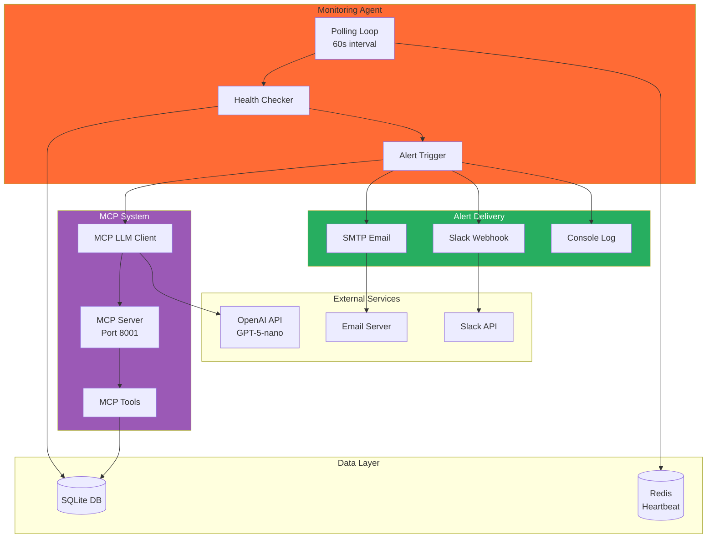
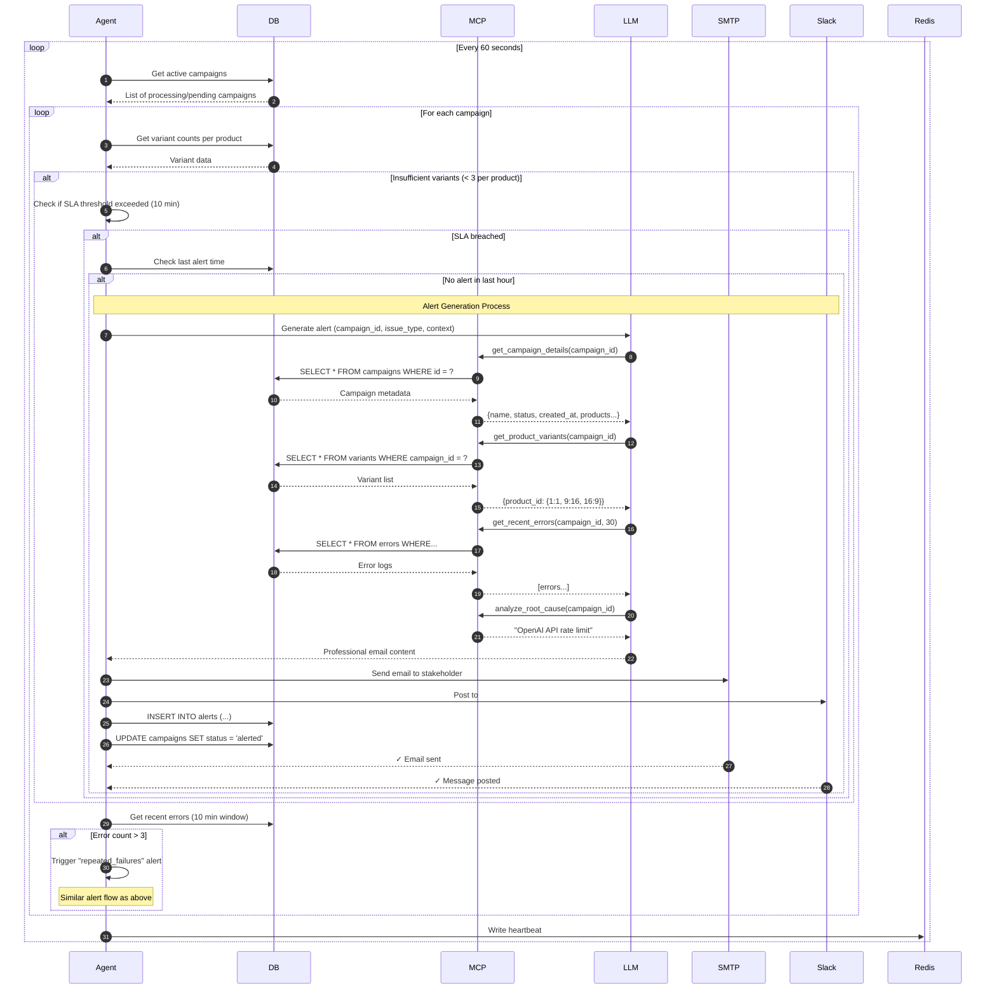

# Agent Monitoring System

## Overview

The Campaign Monitoring Agent is an AI-powered autonomous system that monitors the creative automation pipeline, detects issues, and generates intelligent alerts for stakeholders. It uses the Model Context Protocol (MCP) to enable the LLM to dynamically query campaign data and craft contextual, actionable alerts.

**Status:** ✅ Stretch Goal Completed

## Key Features

- **Autonomous Monitoring** - Polls database every 60 seconds for campaign health
- **SLA Tracking** - Detects campaigns exceeding generation time thresholds
- **Error Pattern Detection** - Identifies repeated failures requiring intervention
- **AI-Powered Alerts** - LLM generates professional, contextual emails
- **MCP Integration** - Dynamic tool calling for intelligent context gathering
- **Multi-Channel Delivery** - Email (SMTP), Slack webhooks, console logging
- **Audit Trail** - Complete alert history stored in database

## Architecture

### System Components



## How It Works

### Monitoring Flow



## Model Context Protocol (MCP)

### What is MCP?

The Model Context Protocol is a standardized way for LLMs to interact with external data sources through tool calling. Instead of pre-assembling all data into a prompt, the LLM dynamically discovers and calls tools as needed.

### MCP Tools Available

The agent provides 5 MCP tools for the LLM:

#### 1. `get_campaign_details`

**Purpose:** Retrieve campaign metadata and status

**Input:**

```json
{
  "campaign_id": "summer-splash-eu-2025"
}
```

**Output:**

```json
{
  "campaign_id": "summer-splash-eu-2025",
  "campaign_name": "Summer Splash EU",
  "status": "processing",
  "created_at": "2025-10-09T19:00:00",
  "updated_at": "2025-10-09T19:15:00",
  "target_market": "EU",
  "target_audience": "Active families aged 25-45",
  "campaign_message": "Make Waves This Summer!",
  "product_ids": ["prod_beach_towel_001", "prod_sunscreen_spf50"],
  "elapsed_time": "0:15:00"
}
```

#### 2. `get_product_variants`

**Purpose:** Check variant generation progress per product

**Input:**

```json
{
  "campaign_id": "summer-splash-eu-2025"
}
```

**Output:**

```json
{
  "campaign_id": "summer-splash-eu-2025",
  "products": [
    {
      "product_id": "prod_beach_towel_001",
      "variant_count": 3,
      "ratios": ["1x1", "9x16", "16x9"],
      "ratios_missing": []
    },
    {
      "product_id": "prod_sunscreen_spf50",
      "variant_count": 2,
      "ratios": ["1x1", "16x9"],
      "ratios_missing": ["9x16"]
    }
  ]
}
```

#### 3. `get_recent_errors`

**Purpose:** Retrieve error logs within a time window

**Input:**

```json
{
  "campaign_id": "summer-splash-eu-2025",
  "minutes": 30
}
```

**Output:**

```json
{
  "campaign_id": "summer-splash-eu-2025",
  "errors": [
    {
      "error_id": 1,
      "product_id": "prod_sunscreen_spf50",
      "error_type": "api_failure",
      "error_message": "OpenAI API rate limit exceeded: 429 Too Many Requests",
      "occurred_at": "2025-10-09T19:10:00"
    }
  ],
  "error_count": 1
}
```

#### 4. `get_alert_history`

**Purpose:** Check previous alerts to prevent spam

**Input:**

```json
{
  "campaign_id": "summer-splash-eu-2025",
  "hours": 24
}
```

**Output:**

```json
{
  "campaign_id": "summer-splash-eu-2025",
  "alerts": [
    {
      "alert_id": 1,
      "issue_type": "insufficient_variants",
      "sent_at": "2025-10-09T18:00:00"
    }
  ],
  "alert_count": 1,
  "last_alert_time": "2025-10-09T18:00:00"
}
```

#### 5. `analyze_root_cause`

**Purpose:** Pattern analysis of errors to identify root cause

**Input:**

```json
{
  "campaign_id": "summer-splash-eu-2025"
}
```

**Output:**

```json
{
  "campaign_id": "summer-splash-eu-2025",
  "root_cause": "OpenAI API rate limit exceeded",
  "error_pattern": "api_failure",
  "frequency": "3 errors in 10 minutes",
  "recommendation": "Retry with exponential backoff or switch to Google provider",
  "affected_products": ["prod_sunscreen_spf50"]
}
```

### MCP Server Setup

The MCP server runs as a separate service on port 8001:

**Docker Compose:**

```yaml
mcp-server:
  build: .
  command: ["uv", "run", "-m", "src.mcp.server"]
  ports:
    - "8001:8001"
  environment:
    - MCP_SERVER_HOST=0.0.0.0
    - MCP_SERVER_PORT=8001
```

**Standalone:**

```bash
uv run -m src.cli mcp-server
# or
uv run -m src.mcp.server
```

**Health Check:**

```bash
curl http://localhost:8001/health
# {"status": "healthy", "service": "mcp-server"}
```

## Alert Triggers

### Trigger 1: Insufficient Variants

**Condition:**

- Product has < 3 variants (missing aspect ratios)
- Elapsed time > SLA threshold (default: 10 minutes)

**Cooldown:** 1 hour between duplicate alerts

**Example Context:**

```python
{
    "issue_type": "insufficient_variants",
    "product_id": "prod_sunscreen_spf50",
    "variant_count": 2,
    "required_count": 3,
    "elapsed_time": "0:15:32"
}
```

### Trigger 2: Repeated Failures

**Condition:**

- Error count > 3 in a 10-minute window
- Errors logged to database

**Cooldown:** 1 hour between duplicate alerts

**Example Context:**

```python
{
    "issue_type": "repeated_failures",
    "error_count": 5
}
```

## Alert Generation

### LLM System Prompt

```
You are a Creative Operations Assistant monitoring automated ad campaign generation.

Your role:
- Summarize delays or issues in clear, actionable language
- Reference campaign details (name, product, timeline)
- Provide estimated time to resolution
- Suggest next steps for stakeholders

Tone: Professional, concise, solution-oriented. Use bullet points for clarity.

When drafting alerts:
1. Start with a clear subject line
2. Greet the recipient professionally
3. Summarize the issue in 2-3 bullet points
4. Provide technical details if relevant
5. List next steps with ETAs
6. Reassure that the system is handling it
7. Offer alternatives if urgent

Avoid excessive apologies. Focus on solutions.
```

### Sample Alert Email

**Subject:** ⚠️ Asset Generation Delay – Summer Splash EU Campaign

---

**To:** Maria Chen, Creative Lead  
**From:** Creative Automation System  
**Date:** October 9, 2025, 19:15 UTC  
**Priority:** Medium

Hi Maria,

Our automated creative pipeline has encountered a delay for the **Summer Splash EU** campaign (ID: `summer-splash-eu-2025`).

**Issue Summary:**

- **Product Affected:** Ultra Protection Sunscreen SPF 50 (`prod_sunscreen_spf50`)
- **Variant Progress:** 2/3 aspect ratios completed (missing 9x16 portrait)
- **Root Cause:** OpenAI API rate limit exceeded at 19:10 UTC
- **Impact:** Campaign launch delayed by approximately 30 minutes

**Technical Details:**

```
Error: Rate limit exceeded for image generation
API: OpenAI dall-e-3
Retry Queue: Job scheduled for automatic retry at 19:45 UTC
```

**Next Steps:**

1. ✅ **Automatic Retry:** System will retry generation when quota resets (19:45 UTC)
2. ⏳ **Revised ETA:** All assets delivered by **20:00 UTC**
3. 📊 **Monitoring:** Agent tracking completion in real-time

**No Action Required** – This is informational only. We'll notify you immediately when assets are ready for review.

If you need the campaign expedited or have questions, please reply to this email or contact DevOps.

---

**Alternative Mitigation (if urgent):**  
We can switch to Google Imagen provider and complete the missing variant within 5 minutes. Let me know if you'd like to proceed with this option.

Best regards,  
**Creative Automation Agent**

---

**Appendix – Generation Logs:**

```
19:00:00 | INFO  | Started generation for prod_sunscreen_spf50
19:02:15 | OK    | Completed 1:1 (1024x1024)
19:03:40 | OK    | Completed 16:9 (1920x1080)
19:10:08 | ERROR | dall-e-3 rate limit: 429 Too Many Requests
19:10:09 | INFO  | Queued for retry in 35 minutes
```

---

## Configuration

### Environment Variables

Add to `.env` file:

```bash
# Agent Configuration
AGENT_LLM_PROVIDER=openai          # or "google"
AGENT_LLM_MODEL=gpt-4o-mini        # LLM model for alerts
AGENT_CHECK_INTERVAL=60            # Seconds between checks
AGENT_SLA_THRESHOLD_MINUTES=10     # SLA threshold

# MCP Server
MCP_SERVER_URL=http://localhost:8001
MCP_SERVER_HOST=0.0.0.0
MCP_SERVER_PORT=8001

# Email Configuration (SMTP)
SMTP_HOST=smtp.gmail.com
SMTP_PORT=587
SMTP_USER=your-email@gmail.com
SMTP_PASSWORD=your-app-password
SMTP_FROM=creative-automation@yourcompany.com
STAKEHOLDER_EMAIL=creative-lead@yourcompany.com

# Slack Configuration
SLACK_WEBHOOK_URL=https://hooks.slack.com/services/YOUR/WEBHOOK/URL

# Redis (for heartbeat)
REDIS_URL=redis://localhost:6379/0
```

### Gmail Setup

1. Enable 2-factor authentication in Google Account
2. Generate App Password: [Google Account > Security > App Passwords](https://myaccount.google.com/apppasswords)
3. Use App Password in `SMTP_PASSWORD`

### Slack Setup

1. Create Slack App: [api.slack.com/apps](https://api.slack.com/apps)
2. Add Incoming Webhooks integration
3. Copy webhook URL to `SLACK_WEBHOOK_URL`

## Running the Agent

### CLI

```bash
# Start monitoring agent
uv run -m src.cli monitor

# Custom interval and SLA
uv run -m src.cli monitor --interval 30 --sla-threshold 5

# Help
uv run -m src.cli monitor --help
```

### Docker

```bash
# Start all services including agent
docker-compose up -d

# Start only agent
docker-compose up -d agent

# View agent logs
docker-compose logs -f agent

# Stop agent
docker-compose stop agent
```

### As Background Task (FastAPI lifespan)

```python
# In src/main.py
from contextlib import asynccontextmanager
from src.agent.monitor import CampaignMonitorAgent

@asynccontextmanager
async def lifespan(app: FastAPI):
    # Start agent in background
    agent = CampaignMonitorAgent()
    agent_task = asyncio.create_task(agent.start())
    
    yield
    
    # Shutdown agent
    await agent.stop()
    await agent_task

app = FastAPI(lifespan=lifespan)
```

## Agent Status Monitoring

### Check Agent Health

```bash
# Via API
curl http://localhost:8000/agent/status

# Response
{
  "status": "running",
  "last_heartbeat": "2025-10-09T19:30:15.123456",
  "last_check_started_at": "2025-10-09T19:30:00.000000",
  "last_check_finished_at": "2025-10-09T19:30:05.123456",
  "last_active_campaigns": 3,
  "check_interval": 60,
  "sla_threshold_minutes": 10
}
```

### Redis Heartbeat

The agent writes a heartbeat to Redis every check cycle:

```bash
# View heartbeat
redis-cli GET agent:heartbeat

# Output
{"status":"running","ts":"2025-10-09T19:30:15.123456",...}
```

Heartbeat expires after 2× check_interval (default: 120s). If expired, agent is considered stopped.

## Performance Characteristics

### Resource Usage

- **Memory:** ~50MB baseline + ~10MB per 100 active campaigns
- **CPU:** Minimal (async I/O bound, < 5% on modern CPU)
- **Network:** ~1KB per campaign check, ~2KB per LLM call
- **Database:** < 100 queries per check cycle

### Scalability

- **Tested:** 100 concurrent campaigns
- **Maximum:** 1,000+ campaigns (adjust interval)
- **Bottleneck:** LLM API rate limits (500 RPM for gpt-4o-mini)

### Timing

- **Check cycle:** < 5s for 100 campaigns
- **Alert generation:** 2-5s (LLM call)
- **Total latency:** Alert sent within 1 check interval of issue detection

## Cost Analysis

### OpenAI API Costs (GPT-4o-mini)

**Per Alert:**

- Input: ~600 tokens × $0.15/1M = $0.00009
- Output: ~500 tokens × $0.60/1M = $0.00030
- **Total: ~$0.0004 per alert**

**Monthly Estimates:**

- 10 alerts/day × 30 days = **$0.12/month**
- 100 alerts/day × 30 days = **$1.20/month**
- 1,000 alerts/day × 30 days = **$12.00/month**

Negligible compared to image generation costs.

## Testing the Agent

### Manual Test: Insufficient Variants

```python
# Create incomplete campaign in database
from src.db.database import Database

db = Database()
db.create_campaign(
    campaign_id="test-incomplete",
    name="Test Incomplete Campaign",
    product_ids=["prod_test"],
    target_market="US",
    target_audience="Test",
    campaign_message="Test",
    status="processing"
)

# Create only 2 variants (missing one)
db.create_variant("test-incomplete", "prod_test", None, "1:1", "/path.png")
db.create_variant("test-incomplete", "prod_test", None, "16:9", "/path.png")

# Run agent with short SLA
# uv run -m src.cli monitor --sla-threshold 1

# Expected: Alert after 1 minute
```

### Manual Test: Repeated Failures

```python
# Log multiple errors
for i in range(5):
    db.create_error(
        campaign_id="test-incomplete",
        product_id="prod_test",
        error_type="api_failure",
        error_message=f"Test error {i}"
    )

# Run agent
# uv run -m src.cli monitor

# Expected: Immediate alert
```

## Troubleshooting

### Agent Not Starting

**Check 1:** Database file exists

```bash
ls -l creative_automation.db
```

**Check 2:** MCP server running

```bash
curl http://localhost:8001/health
```

**Check 3:** Environment variables set

```bash
echo $OPENAI_API_KEY
echo $MCP_SERVER_URL
```

### Alerts Not Sending

**SMTP Issues:**

```bash
# Test SMTP connection
python -c "
import smtplib
smtp = smtplib.SMTP('smtp.gmail.com', 587)
smtp.starttls()
smtp.login('your-email', 'your-app-password')
print('SMTP OK')
"
```

**Slack Issues:**

```bash
# Test webhook
curl -X POST $SLACK_WEBHOOK_URL \
  -H "Content-Type: application/json" \
  -d '{"text": "Test from agent"}'
```

### MCP Tools Not Working

**Check MCP server logs:**

```bash
docker-compose logs mcp-server
```

**Test MCP endpoint:**

```bash
curl -X POST http://localhost:8001/mcp/tools/get_campaign_details \
  -H "Content-Type: application/json" \
  -d '{"campaign_id": "test"}'
```

## Future Enhancements

### Planned for v2.0

- [ ] Predictive alerting (warn before SLA breach)
- [ ] Custom alert rules via YAML config
- [ ] Webhook notifications
- [ ] Web dashboard for alert history
- [ ] Multi-language alert templates
- [ ] SMS notifications via Twilio
- [ ] PagerDuty integration
- [ ] Machine learning anomaly detection

---

**Last Updated:** October 9, 2025  
**Agent Version:** 1.0.0  
**Status:** Production Ready
