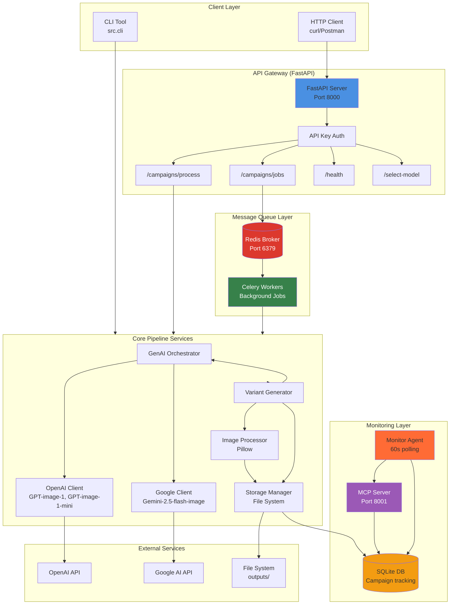
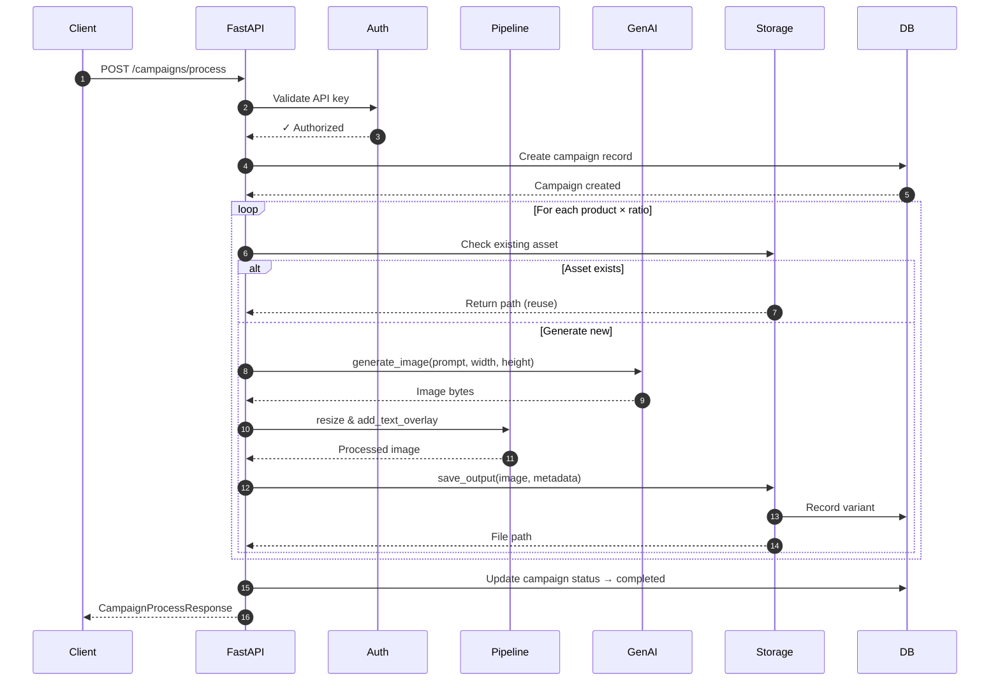
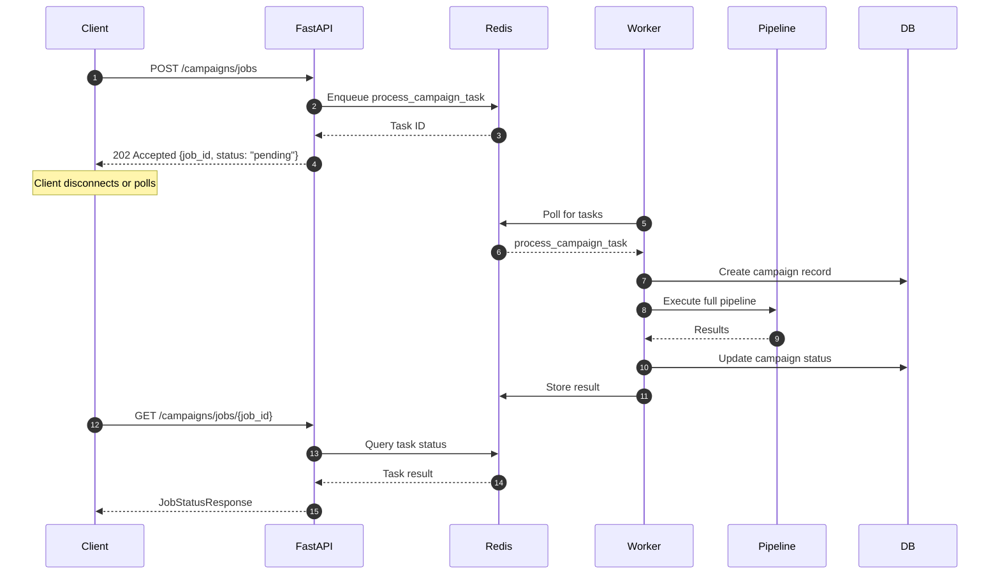
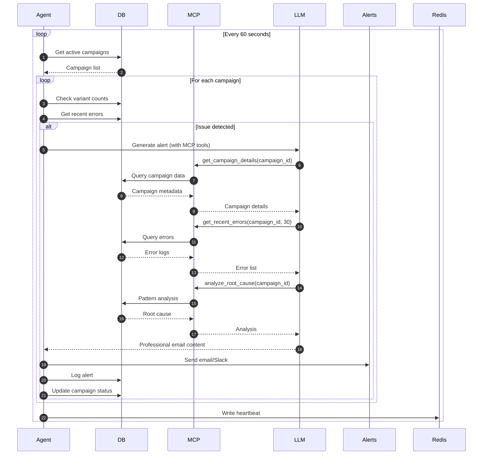

# System Architecture

## Overview

The Creative Automation Pipeline is a microservices-based system for generating marketing creative assets at scale. It combines GenAI image generation, background job processing, and AI-powered monitoring into a production-ready platform.

## Technology Stack

| Layer | Technology | Version | Purpose |
|-------|-----------|---------|----------|
| **API Framework** | FastAPI | 0.104+ | REST endpoints, request validation |
| **Runtime** | Python | 3.11+ | Async support, type hints |
| **Web Server** | Uvicorn | 0.27+ | ASGI server for FastAPI |
| **Message Broker** | Redis | 7.x | Task queue, result backend |
| **Task Queue** | Celery | 5.x | Background job processing |
| **Database** | SQLite | 3.x | Campaign tracking, variant metadata |
| **GenAI - Primary** | OpenAI | Latest | DALL-E 3 image generation |
| **GenAI - Secondary** | Google Gemini | Latest | Alternative image generation |
| **Image Processing** | Pillow (PIL) | 10.1+ | Resize, text overlay, format conversion |
| **Validation** | Pydantic | 2.5+ | Data validation, settings management |
| **HTTP Client** | httpx | 0.28+ | Async HTTP for API calls |
| **MCP Integration** | fastapi-mcp | 0.4.0 | Model Context Protocol server |
| **Containerization** | Docker + Docker Compose | Latest | Multi-service orchestration |

## High-Level Architecture



## Component Details

### 1. API Gateway (FastAPI)

**Location:** `src/main.py`

**Responsibilities:**

- HTTP request handling
- API key authentication
- Request validation with Pydantic
- Response serialization
- Health checks

**Key Endpoints:**

- `GET /health` - Service health status
- `POST /campaigns/process` - Synchronous campaign processing
- `POST /campaigns/jobs` - Asynchronous job creation
- `GET /campaigns/jobs/{job_id}` - Job status polling
- `POST /select-model` - Runtime model configuration
- `GET /current-model` - Current model settings
- `GET /agent/status` - Agent heartbeat status

**Authentication:**

- Header: `X-API-Key: <token>`
- Token validation via `settings.API_AUTH_TOKEN`
- Middleware: `require_api_key()` dependency

### 2. Message Queue (Redis + Celery)

**Redis Configuration:**

- Port: 6379
- Role: Message broker and result backend
- Connection URL: `redis://redis:6379/0`

**Celery Workers:**

- Location: `src/celery_app.py`, `src/tasks.py`
- Command: `celery -A src.celery_app worker --loglevel=INFO`
- Concurrency: Auto-scaled based on CPU cores
- Task: `process_campaign_task`

**Task Workflow:**

1. FastAPI receives request at `/campaigns/jobs`
2. Celery task created with `delay(brief_data)`
3. Task ID returned immediately (202 Accepted)
4. Worker picks up task from Redis queue
5. Worker executes full pipeline
6. Result stored in Redis with task ID
7. Client polls `/campaigns/jobs/{job_id}` for status

### 3. Database (SQLite)

**Location:** `creative_automation.db`  
**Schema:** `src/db/schema.sql`

**Tables:**

**campaigns**

- `id` (TEXT, PK) - Campaign identifier
- `name` (TEXT) - Campaign name
- `product_ids` (TEXT) - JSON array of product IDs
- `target_market` (TEXT) - Target market
- `target_audience` (TEXT) - Audience description
- `campaign_message` (TEXT) - Overlay text
- `status` (TEXT) - pending | processing | completed | failed
- `created_at` (TIMESTAMP)
- `updated_at` (TIMESTAMP)

**variants**

- `id` (INTEGER, PK, AUTOINCREMENT)
- `campaign_id` (TEXT, FK)
- `product_id` (TEXT)
- `variant_name` (TEXT, nullable)
- `aspect_ratio` (TEXT) - 1x1 | 9x16 | 16x9
- `file_path` (TEXT)
- `generated_at` (TIMESTAMP)

**errors**

- `id` (INTEGER, PK, AUTOINCREMENT)
- `campaign_id` (TEXT, FK)
- `product_id` (TEXT, nullable)
- `error_type` (TEXT)
- `error_message` (TEXT)
- `occurred_at` (TIMESTAMP)

**alerts**

- `id` (INTEGER, PK, AUTOINCREMENT)
- `campaign_id` (TEXT, FK)
- `issue_type` (TEXT)
- `alert_content` (TEXT)
- `sent_at` (TIMESTAMP)

### 4. GenAI Orchestration

**Location:** `src/services/genai.py`

**Provider Support:**

- OpenAI DALL-E 3 (primary)
- Google Imagen (secondary)
- Runtime provider switching via `/select-model`

**Image Clients:**

**OpenAI Client** (`src/services/openai_image_client.py`)

- Model: `dall-e-3`
- Sizes: 1024x1024, 1024x1792, 1792x1024
- Quality: standard | hd
- Response format: b64_json

**Google Client** (`src/services/google_image_client.py`)

- Model: `imagen-3.0-generate-001`
- Sizes: 1:1, 9:16, 16:9
- Safety settings: block dangerous content
- Response format: base64 bytes

**Retry Logic:**

- Decorator: `@async_retry` in `src/utils/retry.py`
- Max attempts: 3
- Backoff: Exponential (2s, 4s, 8s)
- Retryable errors: Network timeouts, rate limits (429)

### 5. Image Processing

**Location:** `src/services/processor.py`

**Capabilities:**

- Resize to exact dimensions (LANCZOS resampling)
- Text overlay with semi-transparent background
- Font loading with fallback to default
- Format conversion (PNG output)
- Async offloading via `asyncio.to_thread()`

**Text Overlay Features:**

- Position: bottom (default) or center
- Background: Semi-transparent black (0, 0, 0, 180)
- Font: Noto Sans (fallback to system default)
- Padding: 20px around text
- Text color: White (255, 255, 255, 255)

### 6. Storage Management

**Location:** `src/services/storage.py`

**Directory Structure:**

```
outputs/
  └── {campaign_id}/
      └── {product_id}/
          ├── 1x1/
          │   ├── {product_id}_1x1_{timestamp}.png
          │   └── metadata.json
          ├── 9x16/
          │   ├── {product_id}_9x16_{timestamp}.png
          │   └── metadata.json
          └── 16x9/
              ├── {product_id}_16x9_{timestamp}.png
              └── metadata.json
```

**Metadata JSON:**

```json
{
  "campaign_id": "summer-splash-eu-2025",
  "product_id": "prod_beach_towel_001",
  "product_name": "Premium Beach Towel",
  "aspect_ratio": "1x1",
  "width": 1024,
  "height": 1024,
  "prompt": "Premium Beach Towel, Luxurious oversized...",
  "provider": "openai",
  "model": "dall-e-3",
  "generated_at": "2025-10-09T19:15:30.123456",
  "file_path": "outputs/summer-splash-eu-2025/prod_beach_towel_001/1x1/..."
}
```

**Asset Reuse:**

- Check: `storage.get_asset(product_id, ratio)`
- If exists: Return existing path, skip generation
- Benefits: Cost savings, faster processing, consistency

### 7. Monitoring Agent

**Location:** `src/agent/monitor.py`

**Polling Loop:**

- Interval: 60 seconds (configurable)
- Concurrency: Max 5 campaigns checked in parallel
- Heartbeat: Written to Redis every cycle

**Alert Triggers:**

**1. Insufficient Variants**

- Condition: Product has < 3 variants after SLA threshold (10 minutes)
- Cooldown: 1 hour between duplicate alerts

**2. Repeated Failures**

- Condition: > 3 errors in 10-minute window
- Cooldown: 1 hour between duplicate alerts

**Alert Generation:**

1. Detect issue via database queries
2. Call MCP-enabled LLM client
3. LLM uses MCP tools to gather context
4. LLM generates professional email
5. Deliver via SMTP/Slack/Console
6. Log to alerts table

### 8. MCP Server (Model Context Protocol)

**Location:** `src/mcp/server.py`, `src/mcp/endpoints.py`

**Framework:** `fastapi-mcp` 0.4.0

**MCP Tools (Auto-generated from FastAPI endpoints):**

1. **get_campaign_details**
   - Input: `campaign_id`
   - Returns: Campaign metadata, status, timeline

2. **get_product_variants**
   - Input: `campaign_id`
   - Returns: Variant counts and ratios per product

3. **get_recent_errors**
   - Input: `campaign_id`, `minutes` (optional)
   - Returns: Filtered error logs with timestamps

4. **get_alert_history**
   - Input: `campaign_id`, `hours` (optional)
   - Returns: Previous alerts to prevent spam

5. **analyze_root_cause**
   - Input: `campaign_id`
   - Returns: Error pattern analysis and recommendations

**Integration:**

- HTTP transport on port 8001
- CORS enabled for cross-origin requests
- Health check: `GET /health`
- Tool listing: `POST /mcp` with `tools/list` method

## Data Flow Patterns

### Pattern 1: Synchronous Processing



### Pattern 2: Asynchronous Processing



### Pattern 3: Agent Monitoring with MCP



## Scaling Strategies

### Horizontal Scaling

**API Layer:**

```bash
# Add more FastAPI instances behind load balancer
docker-compose up -d --scale app=3
```

**Worker Layer:**

```bash
# Add more Celery workers for parallel processing
docker-compose up -d --scale worker=5
```

**Redis Layer:**

- Use Redis Sentinel for HA
- Redis Cluster for partitioning
- Separate queues for different priorities

### Vertical Scaling

**Worker Concurrency:**

```bash
celery -A src.celery_app worker --concurrency=10
```

**Database:**

- Migrate from SQLite to PostgreSQL for production
- Add indexes on campaign_id, status, created_at
- Implement connection pooling

### Performance Optimizations

1. **Caching:**
   - Redis for frequently accessed campaign data
   - Asset CDN for image delivery
   - HTTP cache headers for static content

2. **Async Offloading:**
   - PIL operations run in thread pool
   - Database writes batched
   - Parallel variant generation with `asyncio.gather()`

3. **Resource Limits:**
   - Max concurrent API requests
   - Worker task timeout (10 minutes)
   - Image size limits (max 10MB)

## Security Considerations

### API Security

- API key authentication (X-API-Key header)
- Rate limiting (recommended: 100 req/min per key)
- Request size limits (max 10MB)
- CORS configuration for allowed origins

### Data Security

- No PII stored in database
- API keys in environment variables
- Secrets mounted as Docker secrets in production
- Database file permissions (0600)

### GenAI Security

- Prompt injection prevention
- Content filtering for generated images
- API key rotation policy
- Cost limits per campaign

## Monitoring & Observability

### Metrics to Track

**Application Metrics:**

- Request rate (requests/sec)
- Response time (p50, p95, p99)
- Error rate (4xx, 5xx)
- Queue depth (pending tasks)

**Business Metrics:**

- Campaigns processed/hour
- Asset reuse rate (%)
- Average generation time
- Cost per campaign

**Agent Metrics:**

- Alert rate (alerts/hour)
- SLA compliance (%)
- Mean time to detection (MTTD)
- False positive rate

### Logging

**Structured Logging:**

```python
logger.info(
    "Campaign processed",
    extra={
        "campaign_id": campaign.id,
        "products": len(campaign.products),
        "variants_generated": total_variants,
        "duration_seconds": elapsed
    }
)
```

**Log Levels:**

- DEBUG: Detailed flow tracing
- INFO: Normal operations
- WARNING: Asset reuse, retries
- ERROR: API failures, validation errors
- CRITICAL: Service unavailable

### Health Checks

**Endpoints:**

- `GET /health` - Overall service health
- `GET /agent/status` - Agent heartbeat
- `GET /mcp/health` - MCP server health (port 8001)

**Docker Health Checks:**

```yaml
healthcheck:
  test: ["CMD", "curl", "-f", "http://localhost:8000/health"]
  interval: 30s
  timeout: 10s
  retries: 3
```

## Deployment Patterns

See [DEPLOYMENT.md](DEPLOYMENT.md) for detailed production deployment guide.

**Environments:**

- **Development:** Local with uv + SQLite
- **Staging:** Docker Compose + Redis + PostgreSQL
- **Production:** Kubernetes + Cloud SQL + Redis Cluster

## Future Architecture Enhancements

1. **Event-Driven Architecture:**
   - Replace polling with event streams (Kafka/RabbitMQ)
   - Real-time webhook notifications
   - Event sourcing for audit trail

2. **Distributed Tracing:**
   - OpenTelemetry integration
   - Jaeger/Zipkin for request tracing
   - Cross-service correlation IDs

3. **Service Mesh:**
   - Istio for service-to-service communication
   - Mutual TLS between services
   - Traffic shaping and circuit breaking

4. **Multi-Region:**
   - Geographic distribution for low latency
   - Regional failover
   - Cross-region asset replication

---

**Last Updated:** October 9, 2025  
**Maintained By:** Development Team
