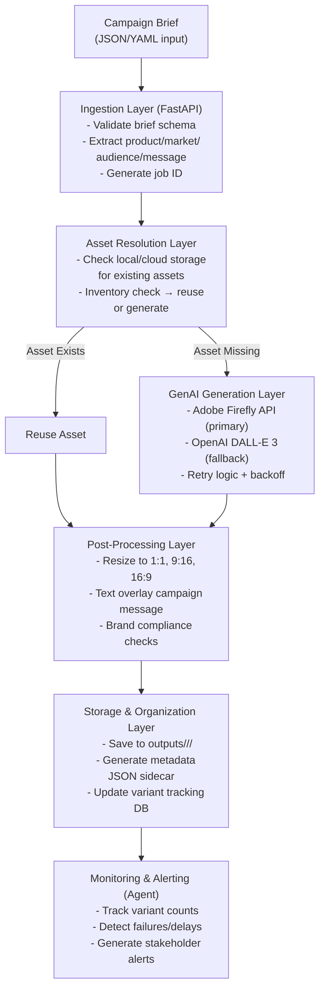

# Technical Specification: Creative Automation Pipeline for Social Campaigns

## Adobe FDE Take-Home Assignment

**Version:** 1.0  
**Last Updated:** October 3, 2025  
**Estimated Effort:** 6-8 hours  
**Target Completion:** [TO BE FILLED]

---

## Table of Contents

1. [Executive Summary](#1-executive-summary)
2. [Project Overview](#2-project-overview)
3. [Technical Stack & Dependencies](#3-technical-stack--dependencies)
4. [Task 1: Architecture & Roadmap](#4-task-1-architecture--roadmap)
5. [Task 2: Pipeline Implementation](#5-task-2-pipeline-implementation)
6. [Task 3: Agentic System Design](#6-task-3-agentic-system-design)
7. [Deliverables Checklist](#7-deliverables-checklist)
8. [Implementation Timeline](#8-implementation-timeline)
9. [Testing Strategy](#9-testing-strategy)
10. [Assumptions & Constraints](#10-assumptions--constraints)

---

## 1. Executive Summary

This specification outlines the technical implementation plan for Adobe's FDE take-home assignment. The solution demonstrates:

- **Enterprise-grade architecture** for creative automation at scale
- **Production-ready code** using FastAPI, GenAI APIs, and cloud storage
- **AI-driven operational oversight** with stakeholder communication
- **Brand compliance** and quality assurance mechanisms

**Core Value Proposition:** Accelerate campaign velocity from weeks to hours while maintaining brand consistency and enabling data-driven optimization.

---

## 2. Project Overview

### 2.1 Business Context

**Client:** Global consumer goods company  
**Use Case:** Launch hundreds of localized social ad campaigns monthly  
**Key Metrics:** Campaign velocity, brand consistency, personalization, ROI, insights

### 2.2 Pain Points Addressed

| Pain Point | Solution Approach |
|------------|-------------------|
| Manual content creation overload | Automated GenAI image generation with 3 aspect ratios |
| Inconsistent quality & messaging | Template-based brand overlays + compliance checks |
| Slow approval cycles | Parallel variant generation, organized output structure |
| Difficulty analyzing at scale | Structured metadata, logging, agent monitoring |
| Resource drain on creative teams | Self-service pipeline via CLI/API |

### 2.3 Success Criteria

✅ Working pipeline that generates 3+ aspect ratios from a single brief  
✅ Asset reuse mechanism (check storage before generating)  
✅ Clear output organization by product and ratio  
✅ Basic brand compliance checks  
✅ Comprehensive documentation and demo video  
✅ Agentic monitoring system design  
✅ Professional stakeholder communication sample  

---

## 3. Technical Stack & Dependencies

### 3.1 Core Technologies

| Layer | Technology | Version | Justification |
|-------|-----------|---------|---------------|
| **Runtime** | Python | 3.11+ | Async support, rich ecosystem |
| **API Framework** | FastAPI | 0.104+ | Type-safe, async, auto-docs |
| **Validation** | Pydantic | 2.5+ | Data validation, settings management |
| **GenAI - Primary** | OpenAI DALL-E 3 | Latest | Accessible, high quality, fallback option |
| **GenAI - Secondary** | Adobe Firefly API | Latest | Brand-safe, ideal for production (if available) |
| **Image Processing** | Pillow (PIL) | 10.1+ | Resize, text overlay, format conversion |
| **Storage - Local** | File system | - | Development/demo mode |
| **Storage - Cloud** | Azure Blob / AWS S3 | Latest SDK | Production-ready (optional) |
| **Queue (Optional)** | In-memory / Redis | - | Job management for async processing |
| **Database** | SQLite | 3 | Variant tracking, lightweight |
| **HTTP Client** | httpx | 0.25+ | Async HTTP for API calls |
| **Testing** | pytest + pytest-asyncio | Latest | Async test support |
| **Linting** | ruff | Latest | Fast Python linter |

### 3.2 API Requirements

**Option A (Recommended for Demo):**

- OpenAI API key with DALL-E 3 access (~$0.04-0.08 per image)
- Estimated cost for demo: $2-5

**Option B (Production-Grade):**

- Adobe Firefly API credentials (primary)
- OpenAI API key (fallback)

**Option C (Mock Mode):**

- Use placeholder images from Unsplash API (free)
- Focus on pipeline architecture over GenAI integration

### 3.3 Development Environment

```bash
# Required
Python 3.11+
pip / poetry
Git

# Optional but Recommended
Docker Desktop
VS Code with Python extension
Postman / Thunder Client (API testing)
OBS Studio / ShareX (demo recording)
```

---

## 4. Task 1: Architecture & Roadmap

### 4.1 High-Level Architecture Diagram

**Components to Design:**



**Diagram Deliverable:** Use Mermaid to create the diagram.

- Include data flow arrows
- Label API endpoints
- Show storage buckets
- Indicate async boundaries
- Add stakeholder touchpoints
- Export as PNG/PDF
- Save to `docs/architecture-diagram.png`

### 4.2 System Components Detail

#### 4.2.1 Asset Ingestion

- **Input Format:** JSON/YAML campaign brief
- **Required Fields:** products[], target_market, target_audience, campaign_message
- **Optional Fields:** brand_guidelines, assets_folder, locales[]
- **Validation:** Pydantic models with strict typing

#### 4.2.2 Storage Strategy

- **Local Mode (Dev):** `./assets/` for input, `./outputs/` for generated
- **Cloud Mode (Prod):** Azure Blob containers or S3 buckets
- **Naming Convention:** `{product_id}_{market}_{ratio}_{timestamp}.png`
- **Metadata:** Companion JSON with prompt, model, seed, generation_time

#### 4.2.3 GenAI Integration

- **Primary:** Adobe Firefly `/v3/images/generate`
- **Fallback:** OpenAI `/v1/images/generations` (DALL-E 3)
- **Prompt Engineering:** Include brand keywords, product name, market context
- **Error Handling:** 3 retries with exponential backoff (2s, 4s, 8s)

#### 4.2.4 Compliance Checks (Bonus)

- **Logo Presence:** OpenCV template matching (threshold >0.8)
- **Color Palette:** ColorThief extraction, delta <10% from brand palette
- **Text Content:** Flagging prohibited words (configurable blocklist)

### 4.3 Roadmap (One-Slide Deliverable)

**Format:** Gantt chart or timeline visualization

| Phase | Duration | Deliverables | Owner |
|-------|----------|--------------|-------|
| **Foundation** | Week 1-2 | Architecture sign-off, API provisioning, repo setup | Engineering + IT |
| **MVP** | Week 3-4 | Core pipeline (single product, 3 ratios, 1 locale) | Engineering |
| **Scale** | Week 5-6 | Multi-product, parallel processing, cloud storage | Engineering + DevOps |
| **Intelligence** | Week 7-8 | Compliance checks, agent monitoring, LLM integration | AI/ML + Engineering |
| **Production** | Week 9-10 | Load testing, security audit, stakeholder training | Full team |
| **Launch** | Week 11-12 | Pilot campaign, feedback loop, optimization | Creative + Ad Ops |

**Milestones:**

- ✅ Prototype Demo (Week 4)
- ✅ Beta Testing (Week 8)
- ✅ Production Launch (Week 12)

---

## 5. Task 2: Pipeline Implementation

### 5.1 Project Structure

```text
creative-automation-pipeline/
├── README.md                    # Comprehensive documentation
├── requirements.txt             # Python dependencies
├── .env.example                 # Environment variables template
├── Makefile                     # Convenience commands
├── docker-compose.yml           # Optional containerization
│
├── src/
│   ├── __init__.py
│   ├── main.py                  # FastAPI application entry point
│   ├── cli.py                   # Command-line interface
│   │
│   ├── models/
│   │   ├── __init__.py
│   │   ├── brief.py             # Campaign brief schema
│   │   ├── asset.py             # Asset metadata schema
│   │   └── job.py               # Job tracking schema
│   │
│   ├── services/
│   │   ├── __init__.py
│   │   ├── ingestion.py         # Brief validation & parsing
│   │   ├── storage.py           # Asset management (local/cloud)
│   │   ├── genai.py             # GenAI orchestration
│   │   ├── firefly_client.py    # Adobe Firefly API wrapper
│   │   ├── dalle_client.py      # OpenAI DALL-E 3 wrapper
│   │   ├── processor.py         # Image resizing & text overlay
│   │   └── compliance.py        # Brand checks (optional)
│   │
│   ├── utils/
│   │   ├── __init__.py
│   │   ├── config.py            # Settings management
│   │   ├── logger.py            # Structured logging
│   │   └── retry.py             # Retry decorator
│   │
│   └── db/
│       ├── __init__.py
│       ├── database.py          # SQLite connection
│       └── models.py            # Variant tracking tables
│
├── tests/
│   ├── __init__.py
│   ├── test_models.py
│   ├── test_ingestion.py
│   ├── test_genai.py
│   ├── test_processor.py
│   └── fixtures/
│       ├── example_brief.json
│       └── mock_assets/
│
├── examples/
│   ├── brief_single_product.json
│   ├── brief_multi_product.json
│   └── brand_config.yaml
│
├── outputs/                     # Generated assets (gitignored)
│   └── .gitkeep
│
└── assets/                      # Input assets (optional reuse)
    └── .gitkeep
```

### 5.2 Core Implementation Components

#### 5.2.1 Campaign Brief Schema (`src/models/brief.py`)

```python
from pydantic import BaseModel, Field, validator
from typing import List, Optional

class Product(BaseModel):
    """Product information for campaign"""
    id: str = Field(..., description="Unique product identifier")
    name: str = Field(..., description="Product display name")
    description: Optional[str] = Field(None, description="Product description for prompt")
    hero_image_url: Optional[str] = Field(None, description="Existing hero image URL")

class CampaignBrief(BaseModel):
    """Campaign brief input schema"""
    campaign_id: str = Field(..., description="Unique campaign identifier")
    products: List[Product] = Field(..., min_items=2, description="At least 2 products")
    target_market: str = Field(..., description="Target region/market (e.g., 'EU', 'US-West')")
    target_audience: str = Field(..., description="Audience persona")
    campaign_message: str = Field(..., max_length=100, description="Text for creative overlay")
    brand_colors: Optional[List[str]] = Field(None, description="Hex color codes")
    locale: str = Field("en", description="Language code (e.g., 'en', 'fr', 'es')")
    
    @validator('products')
    def validate_product_count(cls, v):
        if len(v) < 2:
            raise ValueError("At least 2 products required")
        return v

class AspectRatio(BaseModel):
    """Aspect ratio specification"""
    name: str  # "1:1", "9:16", "16:9"
    width: int
    height: int

ASPECT_RATIOS = [
    AspectRatio(name="1:1", width=1024, height=1024),    # Instagram feed
    AspectRatio(name="9:16", width=1080, height=1920),   # Stories/Reels
    AspectRatio(name="16:9", width=1920, height=1080),   # YouTube/Facebook
]
```

#### 5.2.2 GenAI Service (`src/services/genai.py`)

```python
import asyncio
from typing import Optional
from src.services.firefly_client import FireflyClient
from src.services.dalle_client import DalleClient
from src.utils.logger import get_logger
from src.utils.retry import async_retry

logger = get_logger(__name__)

class GenAIOrchestrator:
    """Orchestrates GenAI image generation with fallback logic"""
    
    def __init__(self, firefly_client: Optional[FireflyClient], dalle_client: DalleClient):
        self.firefly = firefly_client
        self.dalle = dalle_client
    
    @async_retry(max_attempts=3, backoff_factor=2)
    async def generate_image(
        self, 
        prompt: str, 
        width: int, 
        height: int,
        product_id: str
    ) -> bytes:
        """Generate image with fallback strategy"""
        
        # Try Firefly first (brand-safe, Adobe preference)
        if self.firefly and self.firefly.is_available():
            try:
                logger.info(f"Attempting Firefly generation for {product_id}")
                image_data = await self.firefly.generate(
                    prompt=prompt,
                    width=width,
                    height=height
                )
                logger.info(f"Firefly success for {product_id}")
                return image_data
            except Exception as e:
                logger.warning(f"Firefly failed for {product_id}: {e}")
        
        # Fallback to DALL-E 3
        logger.info(f"Using DALL-E 3 for {product_id}")
        image_data = await self.dalle.generate(
            prompt=prompt,
            size=self._map_size_to_dalle(width, height)
        )
        return image_data
    
    def _map_size_to_dalle(self, width: int, height: int) -> str:
        """Map arbitrary size to DALL-E 3 supported sizes"""
        ratio = width / height
        if abs(ratio - 1.0) < 0.1:
            return "1024x1024"
        elif ratio > 1.5:
            return "1792x1024"  # Landscape
        else:
            return "1024x1792"  # Portrait
```

#### 5.2.3 DALL-E Client (`src/services/dalle_client.py`)

```python
import httpx
import base64
from typing import Optional
from src.utils.config import settings

class DalleClient:
    """OpenAI DALL-E 3 API client"""
    
    BASE_URL = "https://api.openai.com/v1"
    
    def __init__(self, api_key: str):
        self.api_key = api_key
        self.client = httpx.AsyncClient(
            base_url=self.BASE_URL,
            headers={
                "Authorization": f"Bearer {api_key}",
                "Content-Type": "application/json"
            },
            timeout=60.0
        )
    
    async def generate(
        self, 
        prompt: str, 
        size: str = "1024x1024",
        quality: str = "standard"
    ) -> bytes:
        """Generate image using DALL-E 3"""
        
        payload = {
            "model": "dall-e-3",
            "prompt": prompt,
            "size": size,
            "quality": quality,
            "n": 1,
            "response_format": "b64_json"
        }
        
        response = await self.client.post("/images/generations", json=payload)
        response.raise_for_status()
        
        data = response.json()
        image_b64 = data["data"][0]["b64_json"]
        return base64.b64decode(image_b64)
    
    async def close(self):
        await self.client.aclose()
```

#### 5.2.4 Image Processor (`src/services/processor.py`)

```python
from PIL import Image, ImageDraw, ImageFont
import io
from typing import Tuple

class ImageProcessor:
    """Post-processing for generated images"""
    
    def __init__(self, font_path: str = None):
        self.font_path = font_path or "arial.ttf"
    
    def resize(self, image_data: bytes, target_width: int, target_height: int) -> bytes:
        """Resize image to target dimensions"""
        img = Image.open(io.BytesIO(image_data))
        img = img.resize((target_width, target_height), Image.Resampling.LANCZOS)
        
        output = io.BytesIO()
        img.save(output, format="PNG")
        return output.getvalue()
    
    def add_text_overlay(
        self, 
        image_data: bytes, 
        text: str,
        position: str = "bottom",
        font_size: int = 48,
        bg_color: Tuple[int, int, int, int] = (0, 0, 0, 180)
    ) -> bytes:
        """Add campaign message as text overlay"""
        img = Image.open(io.BytesIO(image_data))
        
        # Create semi-transparent overlay
        overlay = Image.new('RGBA', img.size, (255, 255, 255, 0))
        draw = ImageDraw.Draw(overlay)
        
        # Load font
        try:
            font = ImageFont.truetype(self.font_path, font_size)
        except:
            font = ImageFont.load_default()
        
        # Calculate text position
        bbox = draw.textbbox((0, 0), text, font=font)
        text_width = bbox[2] - bbox[0]
        text_height = bbox[3] - bbox[1]
        
        if position == "bottom":
            x = (img.width - text_width) // 2
            y = img.height - text_height - 40
        else:  # center
            x = (img.width - text_width) // 2
            y = (img.height - text_height) // 2
        
        # Draw background rectangle
        padding = 20
        draw.rectangle(
            [x - padding, y - padding, x + text_width + padding, y + text_height + padding],
            fill=bg_color
        )
        
        # Draw text
        draw.text((x, y), text, font=font, fill=(255, 255, 255, 255))
        
        # Composite
        img = img.convert('RGBA')
        img = Image.alpha_composite(img, overlay)
        
        output = io.BytesIO()
        img.save(output, format="PNG")
        return output.getvalue()
```

#### 5.2.5 CLI Interface (`src/cli.py`)

```python
import asyncio
import json
import argparse
from pathlib import Path
from src.models.brief import CampaignBrief
from src.services.genai import GenAIOrchestrator
from src.services.dalle_client import DalleClient
from src.services.processor import ImageProcessor
from src.services.storage import StorageManager
from src.utils.config import settings
from src.utils.logger import get_logger

logger = get_logger(__name__)

async def process_campaign(brief_path: str):
    """Main pipeline execution"""
    
    # Load brief
    with open(brief_path, 'r') as f:
        brief_data = json.load(f)
    brief = CampaignBrief(**brief_data)
    
    logger.info(f"Processing campaign: {brief.campaign_id}")
    
    # Initialize services
    dalle_client = DalleClient(api_key=settings.OPENAI_API_KEY)
    orchestrator = GenAIOrchestrator(firefly_client=None, dalle_client=dalle_client)
    processor = ImageProcessor()
    storage = StorageManager(base_path=Path("outputs"))
    
    # Process each product
    for product in brief.products:
        logger.info(f"Processing product: {product.name}")
        
        # Generate prompt
        prompt = f"{product.name}, {product.description or ''}, {brief.target_audience}, {brief.target_market}, professional product photography, high quality"
        
        # Generate for each aspect ratio
        tasks = []
        for ratio in ASPECT_RATIOS:
            task = generate_variant(
                orchestrator=orchestrator,
                processor=processor,
                storage=storage,
                product=product,
                brief=brief,
                ratio=ratio,
                prompt=prompt
            )
            tasks.append(task)
        
        # Execute in parallel
        await asyncio.gather(*tasks)
    
    await dalle_client.close()
    logger.info(f"Campaign {brief.campaign_id} completed!")

async def generate_variant(orchestrator, processor, storage, product, brief, ratio, prompt):
    """Generate single variant"""
    
    # Check if asset exists
    existing_asset = storage.get_asset(product.id, ratio.name)
    if existing_asset:
        logger.info(f"Reusing existing asset: {product.id}/{ratio.name}")
        image_data = existing_asset
    else:
        # Generate new image
        logger.info(f"Generating {ratio.name} for {product.id}")
        image_data = await orchestrator.generate_image(
            prompt=prompt,
            width=ratio.width,
            height=ratio.height,
            product_id=product.id
        )
        
        # Resize if needed
        image_data = processor.resize(image_data, ratio.width, ratio.height)
    
    # Add text overlay
    image_data = processor.add_text_overlay(
        image_data=image_data,
        text=brief.campaign_message
    )
    
    # Save output
    output_path = storage.save_output(
        product_id=product.id,
        ratio_name=ratio.name,
        image_data=image_data,
        metadata={
            "campaign_id": brief.campaign_id,
            "product_name": product.name,
            "ratio": ratio.name,
            "prompt": prompt,
            "market": brief.target_market
        }
    )
    
    logger.info(f"Saved: {output_path}")

def main():
    parser = argparse.ArgumentParser(description="Creative Automation Pipeline")
    parser.add_argument("--brief", required=True, help="Path to campaign brief JSON")
    args = parser.parse_args()
    
    asyncio.run(process_campaign(args.brief))

if __name__ == "__main__":
    main()
```

### 5.3 Configuration (`src/utils/config.py`)

```python
from pydantic_settings import BaseSettings
from typing import Optional

class Settings(BaseSettings):
    """Application settings"""
    
    # API Keys
    OPENAI_API_KEY: str
    ADOBE_FIREFLY_CLIENT_ID: Optional[str] = None
    ADOBE_FIREFLY_CLIENT_SECRET: Optional[str] = None
    
    # Storage
    STORAGE_MODE: str = "local"  # "local" | "azure" | "s3"
    AZURE_STORAGE_CONNECTION_STRING: Optional[str] = None
    AWS_S3_BUCKET: Optional[str] = None
    
    # Processing
    MAX_CONCURRENT_GENERATIONS: int = 3
    RETRY_MAX_ATTEMPTS: int = 3
    RETRY_BACKOFF_FACTOR: float = 2.0
    
    # Logging
    LOG_LEVEL: str = "INFO"
    
    class Config:
        env_file = ".env"
        env_file_encoding = "utf-8"

settings = Settings()
```

### 5.4 Example Campaign Brief

```json
{
  "campaign_id": "summer-splash-eu-2025",
  "products": [
    {
      "id": "prod_beach_towel_001",
      "name": "Premium Beach Towel",
      "description": "Luxurious oversized beach towel with vibrant patterns"
    },
    {
      "id": "prod_sunscreen_spf50",
      "name": "Ultra Protection Sunscreen SPF 50",
      "description": "Dermatologist-tested sunscreen for all skin types"
    }
  ],
  "target_market": "EU",
  "target_audience": "Active families aged 25-45",
  "campaign_message": "Make Waves This Summer! ☀️",
  "brand_colors": ["#FF6B35", "#004E89", "#F4F4F4"],
  "locale": "en"
}
```

### 5.5 Testing Requirements

**Unit Tests:**

- `test_brief_validation()` - Pydantic schema validation
- `test_dalle_client()` - Mock API responses
- `test_image_resize()` - PIL operations
- `test_text_overlay()` - Text rendering
- `test_storage_manager()` - File I/O

**Integration Tests:**

- `test_end_to_end_single_product()` - Full pipeline with 1 product
- `test_asset_reuse()` - Check storage before generation
- `test_api_fallback()` - Firefly failure → DALL-E fallback

**Target Coverage:** 80%+

---

## 6. Task 3: Agentic System Design

### 6.1 Agent Architecture Overview

**Purpose:** Monitor campaign pipeline, track variant counts, detect anomalies, and alert stakeholders.

**Core Responsibilities:**

1. Poll job queue/database every 60 seconds
2. Check SLA compliance (e.g., 3 variants per product within 10 minutes)
3. Detect API failures, quota limits, compliance violations
4. Generate human-readable alerts via email/Slack
5. Log all events for audit trail

### 6.2 Agent Components

#### 6.2.1 Monitoring Agent (`src/agent/monitor.py`)

```python
import asyncio
from datetime import datetime, timedelta
from typing import List, Dict
from src.db.database import get_db
from src.agent.llm_context import generate_alert
from src.utils.logger import get_logger

logger = get_logger(__name__)

class CampaignMonitorAgent:
    """AI-driven monitoring agent"""
    
    def __init__(self, check_interval: int = 60, sla_threshold_minutes: int = 10):
        self.check_interval = check_interval
        self.sla_threshold = timedelta(minutes=sla_threshold_minutes)
    
    async def run(self):
        """Main monitoring loop"""
        logger.info("Campaign Monitor Agent started")
        
        while True:
            try:
                await self.check_campaigns()
                await asyncio.sleep(self.check_interval)
            except Exception as e:
                logger.error(f"Monitor error: {e}")
    
    async def check_campaigns(self):
        """Check all active campaigns"""
        db = get_db()
        active_campaigns = db.get_active_campaigns()
        
        for campaign in active_campaigns:
            # Check variant counts
            variant_counts = db.get_variant_counts(campaign.id)
            
            for product_id, count in variant_counts.items():
                if count < 3:
                    # Check if SLA breached
                    elapsed = datetime.now() - campaign.created_at
                    if elapsed > self.sla_threshold:
                        await self.trigger_alert(campaign, product_id, count)
    
    async def trigger_alert(self, campaign, product_id, variant_count):
        """Generate and send alert"""
        
        # Gather context
        context = {
            "campaign_id": campaign.id,
            "campaign_name": campaign.name,
            "product_id": product_id,
            "variant_count": variant_count,
            "required_count": 3,
            "elapsed_time": str(datetime.now() - campaign.created_at),
            "error_logs": db.get_recent_errors(campaign.id, limit=5)
        }
        
        # Generate LLM-powered alert
        alert_message = await generate_alert(context)
        
        # Send alert (email/Slack/etc.)
        logger.warning(f"ALERT: {alert_message}")
        # TODO: Implement email/Slack integration
```

#### 6.2.2 LLM Context Window (`src/agent/llm_context.py`)

```python
from openai import AsyncOpenAI
from typing import Dict
import json

client = AsyncOpenAI(api_key=settings.OPENAI_API_KEY)

SYSTEM_PROMPT = """You are a creative operations assistant monitoring automated ad campaign generation.

Your role:
- Summarize delays or issues in clear, actionable language
- Reference campaign details (name, product, timeline)
- Provide estimated time to resolution
- Suggest next steps for stakeholders

Tone: Professional, concise, solution-oriented. Use bullet points for clarity."""

async def generate_alert(context: Dict) -> str:
    """Generate human-readable alert from context"""
    
    user_context = f"""
Campaign Issue Detected:

Campaign: {context['campaign_name']} (ID: {context['campaign_id']})
Product: {context['product_id']}
Variant Progress: {context['variant_count']}/3 required
Elapsed Time: {context['elapsed_time']}

Recent Errors:
{json.dumps(context['error_logs'], indent=2)}

Please draft a brief alert email for the creative lead explaining the delay and next steps.
"""
    
    response = await client.chat.completions.create(
        model="gpt-4-turbo-preview",
        messages=[
            {"role": "system", "content": SYSTEM_PROMPT},
            {"role": "user", "content": user_context}
        ],
        max_tokens=300,
        temperature=0.3
    )
    
    return response.choices[0].message.content
```

### 6.3 Variant Tracking Database

**Schema:**

```sql
-- campaigns table
CREATE TABLE campaigns (
    id TEXT PRIMARY KEY,
    name TEXT NOT NULL,
    status TEXT NOT NULL,  -- 'pending', 'processing', 'completed', 'failed'
    created_at TIMESTAMP DEFAULT CURRENT_TIMESTAMP,
    updated_at TIMESTAMP DEFAULT CURRENT_TIMESTAMP
);

-- variants table
CREATE TABLE variants (
    id INTEGER PRIMARY KEY AUTOINCREMENT,
    campaign_id TEXT NOT NULL,
    product_id TEXT NOT NULL,
    aspect_ratio TEXT NOT NULL,  -- '1:1', '9:16', '16:9'
    file_path TEXT NOT NULL,
    generated_at TIMESTAMP DEFAULT CURRENT_TIMESTAMP,
    FOREIGN KEY (campaign_id) REFERENCES campaigns(id)
);

-- errors table
CREATE TABLE errors (
    id INTEGER PRIMARY KEY AUTOINCREMENT,
    campaign_id TEXT NOT NULL,
    product_id TEXT,
    error_type TEXT NOT NULL,  -- 'api_failure', 'quota_exceeded', 'compliance_violation'
    error_message TEXT,
    occurred_at TIMESTAMP DEFAULT CURRENT_TIMESTAMP,
    FOREIGN KEY (campaign_id) REFERENCES campaigns(id)
);
```

### 6.4 Stakeholder Communication Sample

**Subject:** ⚠️ Asset Generation Delay – Summer Splash EU Campaign

---

**To:** Maria Chen, Creative Lead  
**From:** Creative Automation System  
**Date:** October 3, 2025, 14:45 UTC  
**Priority:** Medium

Hi Maria,

Our automated creative pipeline has encountered a delay for the **Summer Splash EU** campaign (ID: `summer-splash-eu-2025`).

**Issue Summary:**

- **Product Affected:** Ultra Protection Sunscreen SPF 50 (`prod_sunscreen_spf50`)
- **Variant Progress:** 2/3 aspect ratios completed (missing 9:16 portrait)
- **Root Cause:** OpenAI DALL-E 3 API rate limit exceeded at 14:35 UTC
- **Impact:** Campaign launch delayed by approximately 30 minutes

**Technical Details:**

```
Error: Rate limit exceeded for image generation
API: OpenAI DALL-E 3
Retry Queue: Job scheduled for automatic retry at 15:05 UTC
```

**Next Steps:**

1. ✅ **Automatic Retry:** System will retry generation when quota resets (15:05 UTC)
2. ⏳ **Revised ETA:** All assets delivered by **15:30 UTC**
3. 📊 **Monitoring:** Agent tracking completion in real-time

**No Action Required** – This is informational only. We'll notify you immediately when assets are ready for review.

If you need the campaign expedited or have questions, please reply to this email or contact DevOps.

---

**Alternative Mitigation (if urgent):**
We can source a stock image from our approved library and customize it within 10 minutes. Let me know if you'd like to proceed with this option.

Best regards,  
**Creative Automation Agent**  
*Powered by Adobe Creative Suite*

---

**Appendix – Generation Logs:**

```
14:30:22 | INFO  | Started generation for prod_sunscreen_spf50
14:32:15 | OK    | Completed 1:1 (1024x1024)
14:33:40 | OK    | Completed 16:9 (1920x1080)
14:35:08 | ERROR | DALL-E 3 rate limit: 429 Too Many Requests
14:35:09 | INFO  | Queued for retry in 30 minutes
```

---

### 6.5 Agent System Diagram

```
┌────────────────────────────────────────────┐
│         Monitoring Agent (Async Loop)      │
│  - Poll DB every 60s                       │
│  - Check variant counts vs. SLA            │
│  - Detect error patterns                   │
└──────────────┬─────────────────────────────┘
               │
               ▼
┌────────────────────────────────────────────┐
│      Decision Engine (Rule-Based)          │
│  IF variant_count < 3 AND elapsed > 10min  │
│  OR error_count > threshold                │
│  THEN trigger_alert()                      │
└──────────────┬─────────────────────────────┘
               │
               ▼
┌────────────────────────────────────────────┐
│      LLM Context Builder                   │
│  - Gather campaign metadata                │
│  - Extract error logs                      │
│  - Format as JSON context (4K tokens max)  │
└──────────────┬─────────────────────────────┘
               │
               ▼
┌────────────────────────────────────────────┐
│      OpenAI GPT-4 (Alert Generation)       │
│  System: "You are creative ops assistant"  │
│  User: <context JSON>                      │
│  Output: Human-readable email draft        │
└──────────────┬─────────────────────────────┘
               │
               ▼
┌────────────────────────────────────────────┐
│      Alerting Service                      │
│  - Send email via SendGrid/SMTP            │
│  - Post to Slack channel (optional)        │
│  - Log to audit trail                      │
└────────────────────────────────────────────┘
```

**Deliverable:** 1-page architecture diagram + 1 sample email (above)

---

## 7. Deliverables Checklist

### 7.1 Task 1: Architecture & Roadmap

- [ ] High-level architecture diagram (Lucidchart/Excalidraw PNG/PDF)
- [ ] One-slide roadmap with timeline (PowerPoint/Google Slides)
- [ ] Technology stack justification (included in presentation)

### 7.2 Task 2: Pipeline Implementation

- [ ] GitHub repository (public, well-structured)
- [ ] Working code (Python 3.11+, FastAPI)
- [ ] `requirements.txt` with pinned versions
- [ ] `.env.example` template
- [ ] Comprehensive `README.md` with:
  - [ ] Problem statement
  - [ ] Architecture overview
  - [ ] Setup instructions
  - [ ] Usage examples
  - [ ] Design decisions
  - [ ] Assumptions & limitations
- [ ] Example campaign briefs (JSON)
- [ ] Generated outputs (screenshots in README)
- [ ] Unit tests (pytest, 80%+ coverage)
- [ ] Demo video (3-5 minutes, MP4/unlisted YouTube)

### 7.3 Task 3: Agentic System

- [ ] Agent architecture diagram
- [ ] LLM context window design document
- [ ] Sample stakeholder email (formatted, professional)
- [ ] (Optional) Working prototype agent

### 7.4 Presentation

- [ ] 30-minute slide deck covering all tasks
- [ ] Live demo preparation (local environment tested)
- [ ] Q&A prep (anticipated questions)

---

## 8. Implementation Timeline

**Total Effort:** 6-8 hours  
**Recommended Schedule:**

| Time Block | Duration | Activity | Output |
|------------|----------|----------|--------|
| **Session 1** | 1.5 hrs | Architecture design | Diagram + roadmap |
| **Session 2** | 2 hrs | Core pipeline scaffold | Models, clients, basic CLI |
| **Session 3** | 1.5 hrs | Image processing & storage | Resize, overlay, file I/O |
| **Session 4** | 1 hr | Integration & testing | End-to-end test, bug fixes |
| **Session 5** | 1 hr | Agent design & email | Diagram, sample communication |
| **Session 6** | 1 hr | Documentation & demo | README, video recording |
| **Buffer** | 0.5-2 hrs | Polish, rehearsal | Presentation prep |

**Milestone Gates:**

- ✅ After Session 2: Can generate 1 image via CLI
- ✅ After Session 3: Can generate 3 ratios with text overlay
- ✅ After Session 4: Full pipeline works end-to-end
- ✅ After Session 6: Deliverables ready for submission

---

## 9. Testing Strategy

### 9.1 Unit Tests

```python
# tests/test_models.py
def test_campaign_brief_validation():
    """Test Pydantic schema validation"""
    valid_brief = {
        "campaign_id": "test-001",
        "products": [
            {"id": "p1", "name": "Product 1"},
            {"id": "p2", "name": "Product 2"}
        ],
        "target_market": "US",
        "target_audience": "Test audience",
        "campaign_message": "Test message"
    }
    brief = CampaignBrief(**valid_brief)
    assert brief.campaign_id == "test-001"
    assert len(brief.products) == 2

def test_campaign_brief_requires_two_products():
    """Test minimum product validation"""
    invalid_brief = {
        "campaign_id": "test-001",
        "products": [{"id": "p1", "name": "Product 1"}],  # Only 1 product
        "target_market": "US",
        "target_audience": "Test",
        "campaign_message": "Test"
    }
    with pytest.raises(ValidationError):
        CampaignBrief(**invalid_brief)

# tests/test_processor.py
@pytest.mark.asyncio
async def test_image_resize():
    """Test image resizing"""
    processor = ImageProcessor()
    
    # Create test image
    img = Image.new('RGB', (2048, 2048), color='red')
    img_bytes = io.BytesIO()
    img.save(img_bytes, format='PNG')
    
    # Resize
    resized = processor.resize(img_bytes.getvalue(), 1024, 1024)
    
    # Verify
    result_img = Image.open(io.BytesIO(resized))
    assert result_img.size == (1024, 1024)
```

### 9.2 Integration Tests

```python
# tests/test_integration.py
@pytest.mark.asyncio
async def test_end_to_end_pipeline(tmp_path):
    """Test full pipeline with mock GenAI"""
    
    # Mock DALL-E response
    mock_image = create_mock_image()
    
    with patch('src.services.dalle_client.DalleClient.generate', return_value=mock_image):
        # Run pipeline
        result = await process_campaign("tests/fixtures/example_brief.json")
        
        # Verify outputs
        assert (tmp_path / "outputs/prod_001/1:1/image.png").exists()
        assert (tmp_path / "outputs/prod_001/9:16/image.png").exists()
        assert (tmp_path / "outputs/prod_001/16:9/image.png").exists()
```

### 9.3 Manual Testing Checklist

- [ ] Run with valid brief → 3 aspect ratios generated
- [ ] Run with existing assets → assets reused
- [ ] Run with invalid API key → graceful error handling
- [ ] Run with missing product description → still generates
- [ ] Check output folder organization → correct structure
- [ ] Verify text overlay → message visible and readable
- [ ] Test with 2 products → 6 total images (2 products × 3 ratios)

---

## 10. Assumptions & Constraints

### 10.1 Assumptions

1. **API Access:** OpenAI API key with DALL-E 3 access is available
2. **Internet Connectivity:** Stable connection for API calls
3. **Local Execution:** Pipeline runs on developer machine (Windows/macOS/Linux)
4. **Input Format:** Campaign briefs provided as valid JSON
5. **Storage:** Sufficient disk space for generated images (~50MB per campaign)
6. **Fonts:** System has default fonts for text overlay
7. **Demo Scope:** 2-3 products per campaign is representative

### 10.2 Constraints

1. **Time Limit:** 6-8 hours total implementation time
2. **Cost:** Minimize GenAI API costs (<$10 for demo)
3. **Complexity:** Balance feature richness vs. time
4. **Dependencies:** Use mainstream libraries (avoid obscure packages)
5. **Platform:** Must run on interviewer's machine (clear setup docs)

### 10.3 Out of Scope (Nice-to-Have)

- ❌ Advanced compliance checks (deep learning logo detection)
- ❌ Real cloud deployment (Azure/AWS infrastructure)
- ❌ Production-grade authentication
- ❌ Web UI (focus on CLI/API)
- ❌ Multi-language localization (English primary)
- ❌ Video asset generation
- ❌ A/B testing recommendations

### 10.4 Limitations

1. **GenAI Quality:** Output depends on DALL-E 3 prompt quality
2. **Brand Consistency:** Basic text overlay, not full brand guidelines
3. **Scalability:** Single-threaded, not optimized for 100s of concurrent campaigns
4. **Error Recovery:** Simple retry logic, no sophisticated failure handling
5. **Monitoring:** Polling-based agent, not real-time event streams

---

## Appendix A: Presentation Outline

**Duration:** 30 minutes (25 min presentation + 5 min Q&A)

### Slide Breakdown

1. **Title Slide** (0:30)
   - Assignment overview, your name, date

2. **Problem Statement** (2:00)
   - Client pain points recap
   - Business goals alignment

3. **Solution Overview** (2:00)
   - High-level value proposition
   - Key features at a glance

4. **Architecture Deep Dive** (5:00)
   - Architecture diagram walkthrough
   - Technology stack justification
   - Data flow explanation

5. **Roadmap** (2:00)
   - Timeline visualization
   - Milestones and stakeholders

6. **Live Demo** (10:00)
   - Show example brief
   - Run pipeline command
   - Show generated outputs
   - Explain folder structure

7. **Code Walkthrough** (3:00)
   - Highlight key design decisions
   - Show Pydantic models
   - Explain GenAI orchestration logic

8. **Agentic System** (3:00)
   - Agent architecture diagram
   - LLM context window design
   - Sample stakeholder email

9. **Testing & Quality** (1:30)
   - Test coverage report
   - Compliance checks demo

10. **Lessons Learned** (1:00)
    - Trade-offs made
    - What you'd improve with more time

11. **Q&A** (5:00)

---

## Appendix B: Quick Start Commands

```bash
# Setup
git clone <your-repo>
cd creative-automation-pipeline
python -m venv venv
source venv/bin/activate  # Windows: venv\Scripts\activate
pip install -r requirements.txt
cp .env.example .env
# Edit .env with your OPENAI_API_KEY

# Run pipeline
python -m src.cli --brief examples/brief_single_product.json

# Run tests
pytest tests/ -v --cov=src

# Lint
ruff check src/

# Generate demo
# (Record terminal session with demo brief)
```

---

## Appendix C: Recommended Tools

| Purpose | Tool | Link |
|---------|------|------|
| Architecture Diagrams | Excalidraw | <https://excalidraw.com> |
| Roadmap | Lucidchart / Miro | <https://lucidchart.com> |
| Screen Recording | OBS Studio | <https://obsproject.com> |
| Presentation | Google Slides | <https://slides.google.com> |
| API Testing | Postman | <https://postman.com> |
| Code Editor | VS Code | <https://code.visualstudio.com> |

---

**Document Status:** Draft v1.0  
**Next Steps:** Review with user, refine based on API access and timeline  
**Owner:** [Your Name]  
**Last Updated:** October 3, 2025
